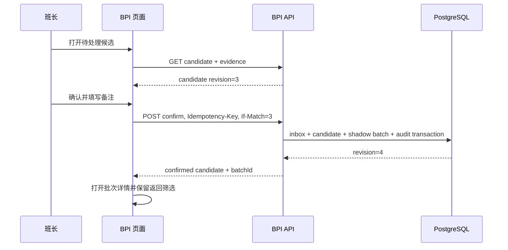
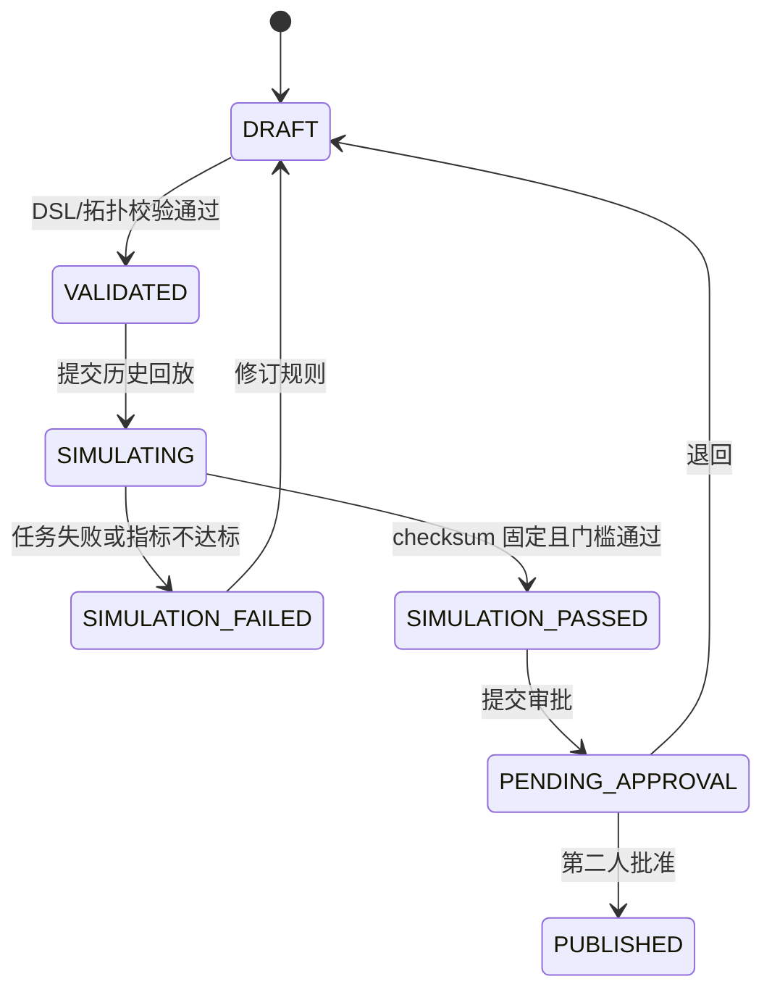
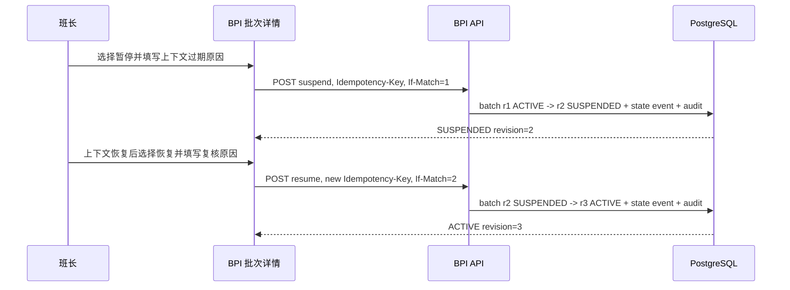

# BPI 智能批次与工艺数据中心交互设计

状态：Phase 0/1 产品交互基线
依据：`2026-07-12-batch-process-intelligence.md`、`batch-process-intelligence.md`
产品边界：嵌入现有 MES，首期只运行影子批次，不控制 PLC/DCS，不自动写 WOM/QCS/WMS。

## 1. 设计目标

BPI 的第一任务不是展示更多图表，而是帮助用户把“连续生产信号”审成“可信生产事实”。
所有关键界面围绕四个问题组织：

1. 当前生产线正在发生什么？
2. 系统为什么判断这里应该开始或结束一个批次？
3. 人工确认、拒绝或修订后留下了什么证据？
4. 这批物料如何关联生产指令、质量、库存和训练数据？

首期产品以桌面端调度室和工程师工作站为主，支持 1366px 以上视口。窄屏保留查询和审批，
拓扑编辑、规则编辑和曲线对比提示转到桌面完成。

## 2. 产品壳与信息架构

浏览器继续使用 MES 统一入口。BPI 一级菜单名称为“智能批次”，不新增独立登录页。

```text
MES 顶部标签
└─ 智能批次
   ├─ 实时生产态势       /bpi/overview
   ├─ 候选批次           /bpi/candidates
   ├─ 批次档案           /bpi/batches
   ├─ 工艺拓扑           /bpi/topologies
   ├─ 边界规则           /bpi/rules
   ├─ 数据质量           /bpi/data-quality
   ├─ 训练数据集         /bpi/datasets
   ├─ 集成运行           /bpi/integrations
   └─ 审计记录           /bpi/audit
```

布局沿用现有 ADP 的紧凑型后台界面：顶部标签、左侧模块导航、主区域工具栏和数据表。
详情使用全宽页面或右侧抽屉，不把关键业务放入多层卡片。列表工具栏固定在表格上方，
图标按钮均有 tooltip；危险命令使用文本命令和二次确认。

## 3. 角色与操作边界

| 角色 | 默认首页 | 可执行命令 | 明确禁止 |
|---|---|---|---|
| 调度/班长 | 实时生产态势 | 确认/拒绝候选、暂停、恢复、申请强制结束 | 修改或发布规则 |
| 工艺工程师 | 边界规则 | 拓扑草拟、测点绑定、规则草拟、模拟 | 单人发布规则、修改原始事件 |
| 质量人员 | 批次档案 | 关联样品、复核质量门、提交处置意见 | 改批次边界和规则 |
| 仓储人员 | 批次档案 | 复核 WMS 回执、重查幂等单据 | 直接改 BPI 累计量 |
| 数据工程师 | 数据质量 | 数据质量处置、生成数据集快照 | 修改生产事实和质量结果 |
| 审批人 | 待审批规则/修订 | 发布规则、批准重大修订/强制结束 | 草拟后自行审批 |
| 系统管理员 | 集成运行 | 集成配置、服务诊断、权限配置 | 自动获得工艺审批权 |
| 审计人员 | 审计记录 | 查询、导出审计链 | 任何业务写操作 |

权限判断同时校验 tenant、plant、line 和对象状态。页面隐藏无权限按钮只是体验处理，
后端仍执行对象级授权。权限变化后旧页面提交返回 `403`，提示“权限已变化，请刷新页面”。

## 4. 全局交互约定

### 4.1 状态颜色

| 语义 | 颜色用途 | 示例 |
|---|---|---|
| 正常/已完成 | 绿色 | ACTIVE 正常、模拟通过、数据健康 |
| 待处理/进行中 | 蓝色 | CANDIDATE、后台任务运行中 |
| 注意/降级 | 琥珀色 | 缺少非关键证据、局部曲线不可用 |
| 阻断/失败 | 红色 | required 信号失效、质量门阻断、命令失败 |
| 已停止/历史 | 灰色 | CLOSED、REJECTED、过期版本 |

颜色不作为唯一信息载体，状态必须同时显示文字和图标。

### 4.2 通用实体状态

所有页面复用统一 `EntityPanel` 行为：

| 状态 | 页面行为 |
|---|---|
| `loading` | 保留稳定布局，表头和关键区使用骨架，不整页闪白 |
| `empty` | 显示业务空态和下一动作，例如“待生产，最后心跳 10:32:04” |
| `partial` | 可用事实继续显示，受影响区域独立告警并给出重试入口 |
| `error` | 显示可理解的问题、traceId、重试和返回路径，不展示 Java 异常栈 |
| `success` | 展示数据更新时间和查询快照时间 |

### 4.3 命令反馈

- 所有命令按钮点击后立即禁用，显示进行中状态，避免双击。
- 每次命令生成 `Idempotency-Key`；页面恢复后可按 taskId 查询结果。
- 更新命令携带 `If-Match` revision。发生 `409` 时展示服务器新版本与用户当前草稿差异。
- 网络超时不直接显示失败，先按 idempotency key 查询命令结果。
- 高风险命令必须填写原因；强制结束和重大修订要求审批人。

## 5. 页面规格

### 5.1 实时生产态势 `/bpi/overview`

**用户目标：** 在一个屏幕内识别正在生产、等待确认和数据失真的产线。

页面由工厂/车间筛选条、产线状态表、工艺阶段带和异常队列组成。产线状态表固定列：

- 产线、生产指令、当前批次、工段、运行状态；
- 边界置信度、累计量、瞬时流量、波美/Brix；
- required 信号健康度、最后事件时间、待处理候选数。

点击产线打开右侧“实时证据”抽屉，包含最近 15 分钟关键点趋势、阀泵路径、当前规则条件、
已满足/未满足证据和数据质量影响。点击批次号进入批次详情；点击待处理数跳到已带筛选的候选页。

刷新采用增量轮询或 SSE，表格行不因刷新重新排序。用户切换“仅异常”后只显示有候选、
required 信号异常或上下文过期的产线。没有生产时显示最后心跳和最近一次批次，不留白页。

**主要 API：** `getBpiOverview`、`getCurrentLineState`。

### 5.2 候选批次 `/bpi/candidates`

**用户目标：** 快速判断系统提出的 START/END 边界是否可信。

默认按影响优先级排序，筛选项包括工厂、产线、边界类型、置信度、规则版本、候选状态和时间。
列表列：候选时间、产线、START/END、关联指令、置信度、证据满足数、缺失项、数据质量影响、状态。

点击一行进入候选审核工作区，左侧是时间轴和关键曲线，右侧是规则证据：

- required/quorum/optional 分组；
- 每个信号的值、单位、质量、事件时间、来源和校准版本；
- 规则版本、拓扑版本、第一法定 quorum 事件和确定性 candidate key；
- WOM 上下文及其有效期。

底部命令为“确认候选”“拒绝候选”“暂不处理”。确认前显示拟生成的批次号、起止时间和影响；
拒绝必须选择原因。证据不足时确认按钮降级为“提交人工确认”，要求备注并进入审计。

**冲突处理：** 第二位用户确认已处理候选时，不弹泛化错误，直接刷新为“已由某人确认”，
保留其审核备注和时间。

拒绝候选必须填写误判、上下文错误或现场处置依据。拒绝成功后候选变为 `REJECTED`，从待处理队列
移除且不得创建影子批次；同一幂等键重试返回原拒绝结果。已拒绝候选不能再被旧页面确认。

**主要 API：** `listBatchCandidates`、`getBatchCandidate`、`confirmBatchCandidate`、
`rejectBatchCandidate`。

### 5.3 批次档案 `/bpi/batches`

**用户目标：** 查询权威批次及其生产、质量、库存状态。

列表使用 cursor 分页和固定 `snapshotAt`，筛选包括批次号、指令、产线、工段、状态、质量处置、
WMS 状态、规则版本和时间范围。列：批次号、物料、产线/工段、开始/结束、累计量、干物量、
平衡差异、质量门、库存状态、当前 revision。

批次状态持续变化时不重排当前页；顶部提示有新数据，用户主动刷新查询快照。

**主要 API：** `listBatches`、`getBatch`。

### 5.4 批次详情 `/bpi/batches/{batchId}`

页面顶部固定显示批次号、状态、工段、指令、规则/拓扑版本、revision 和审计状态。内容使用标签页：

1. **概览**：时间、数量、物料、班组、质量门和 WMS 回执。
2. **边界证据**：START/END 证据、置信度、缺失/降级项和原始事件引用。
3. **工艺趋势**：关键点曲线、阶段标记和异常区间；原始库不可用时仅该标签降级。
4. **物料平衡**：输入、输出、干物、能源、估算量、分配规则和差异。
5. **批次谱系**：分流、合流、回配 DAG，支持向上/向下展开。
6. **质量与库存**：检验申请、required inspection set、处置、WMS 幂等命令和回执。
7. **修订与审计**：append-only 状态事件、修订前后差异、审批和 traceId。

允许命令根据状态显示：暂停、恢复、申请强制结束、提交修订。修订采用字段级表单，原值只读，
新值、原因、证据和影响评估必填。不会直接覆盖原批次记录。

首期已经实现的运行控制严格限定为 `ACTIVE -> SUSPENDED -> ACTIVE`。详情页在 `ACTIVE` 时只显示
“暂停自动处理”，在 `SUSPENDED` 时只显示“恢复自动处理”，其他状态不显示这两个命令。暂停与恢复
都要求原因、`Idempotency-Key` 和当前 `If-Match` revision；成功后批次 revision 加一，并追加
`BATCH_SUSPENDED` 或 `BATCH_RESUMED` 状态事件和批次审计。暂停不会结束批次、修改累计量或向
WOM/QCS/WMS 写数据；恢复也不会补造缺失事件，而是从已审计的同一批次继续自动处理。

**主要 API：** `getBatch`、`getBatchEvidence`、`getBatchBalance`、`getBatchGenealogy`、
`getBatchTimeline`、`suspendBatch`、`resumeBatch`、`forceCloseBatch`、`createBatchCorrection`。

### 5.5 工艺拓扑 `/bpi/topologies`

**用户目标：** 版本化维护工段、设备路径和测点语义。

左侧为 plant/line/stage 树，中间为二维节点与连接，右侧为选中对象属性。节点类型包括工段、罐、
泵、阀、meter 和逻辑边界。工具栏提供选择、连接、校验、版本对比、保存草稿、提交审批。

测点绑定表列出 JetLinks product/device/property、语义、单位、优先级、校准版本和 locality group。
发布前校验 required 信号缺失、单位不兼容、路径悬空、共享 meter 未分配和循环批次谱系风险。

拓扑发布后不可修改；从已发布版本复制新草稿。正在运行的批次继续固定引用旧版本。

**主要 API：** `listTopologies`、`getTopologyVersion`、`createTopologyDraft`、
`validateTopologyDraft`、`publishTopologyVersion`。

### 5.6 边界规则 `/bpi/rules`

**用户目标：** 使用受控 DSL 配置多信号批次边界并通过回放后发布。

规则列表显示规则编码、适用工段、版本、状态、拓扑版本、最近模拟结果和发布人。规则编辑器采用
条件组而非自由脚本：信号、比较符、阈值、持续时间、required/quorum/optional、迟到窗口、
静默时间和 penalty。右侧持续显示生成的只读 AST 与校验结果。

“模拟”打开参数抽屉，选择产线、时间范围、拓扑/校准版本和黄金批次集。提交后返回后台 taskId；
用户离开页面任务继续。结果页对比自动边界与人工边界，展示命中、漏判、误判、时间偏差、
累计量差异和 checksum。只有模拟 `PASSED` 且 checksum 与当前草稿一致时才能提交发布。

发布使用双人审批。规则版本发布后不可修改；新版本通过复制产生。

**主要 API：** `listRules`、`getRuleVersion`、`createRuleDraft`、`simulateRule`、
`getRuleSimulation`、`publishRuleVersion`。

### 5.7 数据质量 `/bpi/data-quality`

按“影响批次优先”而非按原始事件数量排序。顶部汇总 required 信号不可用、时钟漂移、单位未知、
序列断点、共享 meter 未分配和缓冲区告警。列表按 source+point+issue 聚合，显示持续时间、
事件数、影响产线/规则/批次、当前责任人和处置状态。

详情抽屉展示首次/最近事件、质量时间轴、影响分析和推荐动作。确认、分派、解决均要求备注；
解决不会删除原事件。超过 10,000 项使用服务端聚合和虚拟列表。

**主要 API：** `listDataQualityIncidents`、`getDataQualityIncident`、
`acknowledgeDataQualityIncident`、`resolveDataQualityIncident`。

### 5.8 训练数据集 `/bpi/datasets`

数据集定义列表显示特征版本、标签版本、prediction time、允许批次状态、排除规则和最近快照。
创建快照时选择冻结时间、工厂/产线/工段、规则版本和数据范围。预检必须显示：低置信度批次数、
人工修订数、缺标签数、未来信息泄漏风险和估算输出规模。

快照为后台任务，页面关闭后继续。结果展示 manifest、checksum、Iceberg snapshot、MLflow run、
排除统计和下载入口。已发布快照不可覆盖。

**主要 API：** `listDatasets`、`createDatasetSnapshot`、`getDatasetSnapshot`。

### 5.9 集成运行 `/bpi/integrations`

展示 JetLinks exporter、Kafka、Flink、WOM、QCS、WMS、TimescaleDB、PostgreSQL 和 MinIO 的健康、
最后成功时间、lag、spool 使用率和降级影响。健康值与业务影响分开：例如 TimescaleDB 曲线不可用
不阻断批次事实查询；WOM 上下文过期会阻断自动确认。

管理员可执行连通性检查和查看脱敏配置，不在页面显示凭据。首期不提供 PLC 写命令。

**主要 API：** `getIntegrationHealth`、`runIntegrationCheck`。

### 5.10 审计记录 `/bpi/audit`

按 batchId、candidateKey、ruleVersion、user、action、traceId 和时间查询。记录显示命令输入摘要、
前后 revision、审批链、API 状态和关联 outbox/inbox。原始敏感 payload 默认折叠并按权限脱敏。

**主要 API：** `listAuditEvents`、`getAuditEvent`。

## 6. 核心流程

### 6.1 候选确认到影子批次



### 6.2 规则模拟与发布



### 6.3 批次暂停与恢复



## 7. 异常与恢复

| 场景 | 用户看到 | 可恢复动作 |
|---|---|---|
| 同一候选被他人处理 | 最新处理人、结果、时间和备注 | 打开已生成批次 |
| revision 过期 | 字段级差异和服务器最新值 | 合并后重新提交 |
| 命令超时 | “结果确认中”而非直接失败 | 按 idempotency key 查询 |
| 曲线库不可用 | 详情事实可用，曲线标签局部错误 | 重试曲线，不刷新整页 |
| WOM 上下文过期 | 自动确认关闭并显示影响规则 | 刷新上下文或人工审核 |
| QCS 不可用 | 批次停留 WAIT_QA | 查看重试和 incident |
| WMS 回执超时 | 显示查单中，禁止再次创建 | 按 key 查单后再重试 |
| 规则模拟服务重启 | 后台 task 状态恢复 | 继续查看同一 taskId |
| 无当前批次 | “待生产”和最后心跳 | 查看最近批次 |

## 8. 可访问性与效率

- 所有主流程可用键盘完成，焦点顺序与视觉顺序一致。
- 表格支持固定表头、列显隐、密度切换和可复制批次号。
- 图表/拓扑提供同等信息的表格视图，颜色异常有文字标签。
- 关键按钮不只用颜色区分；危险操作不与普通保存相邻。
- 页面保留用户筛选和返回位置，详情返回不会丢失列表上下文。
- 10,000 行以上使用服务端聚合、cursor 分页和虚拟渲染。

## 9. Phase 1 模拟验收范围

首批模拟器必须覆盖：

1. 查询实时产线状态和待处理 START 候选。
2. 读取候选证据并确认，生成唯一影子批次。
3. 使用相同 `Idempotency-Key` 重试不重复生成批次。
4. 使用旧 revision 再提交返回 `409` 和当前 revision。
5. 从批次详情暂停 `ACTIVE` 批次，看到 `SUSPENDED/r2`、产线 `BLOCKED` 和追加事件。
6. 从同一详情恢复批次，看到 `ACTIVE/r3`、产线 `RUNNING` 和追加事件。
7. 查询批次详情、证据、平衡和谱系。
8. 提交规则模拟，得到可复现 checksum，并以该 simulation 发布规则。
9. 查询数据质量事件并看到受影响的产线、规则和批次。

模拟验收不证明真实 JetLinks、Kafka、Flink 或 PostgreSQL 已接通；真实环境仍需执行
浏览器、API、PostgreSQL marker 和回滚验收。
