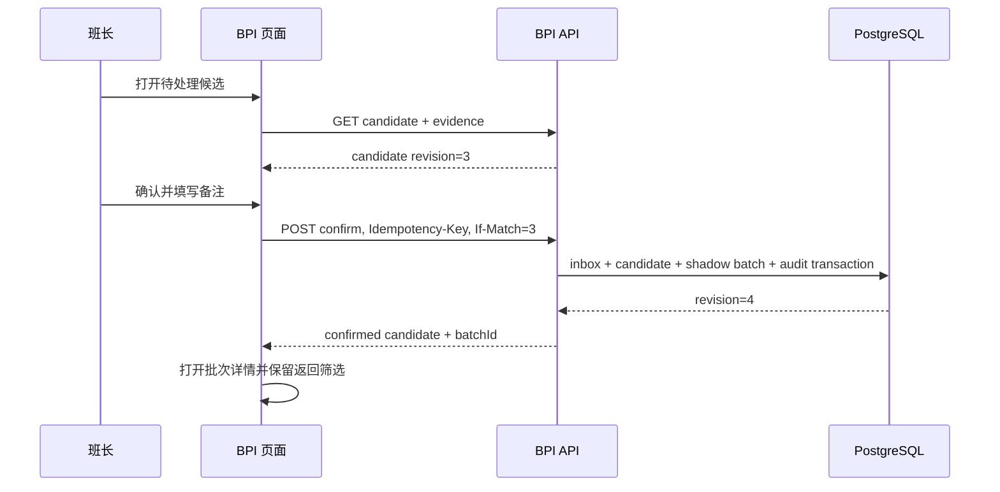
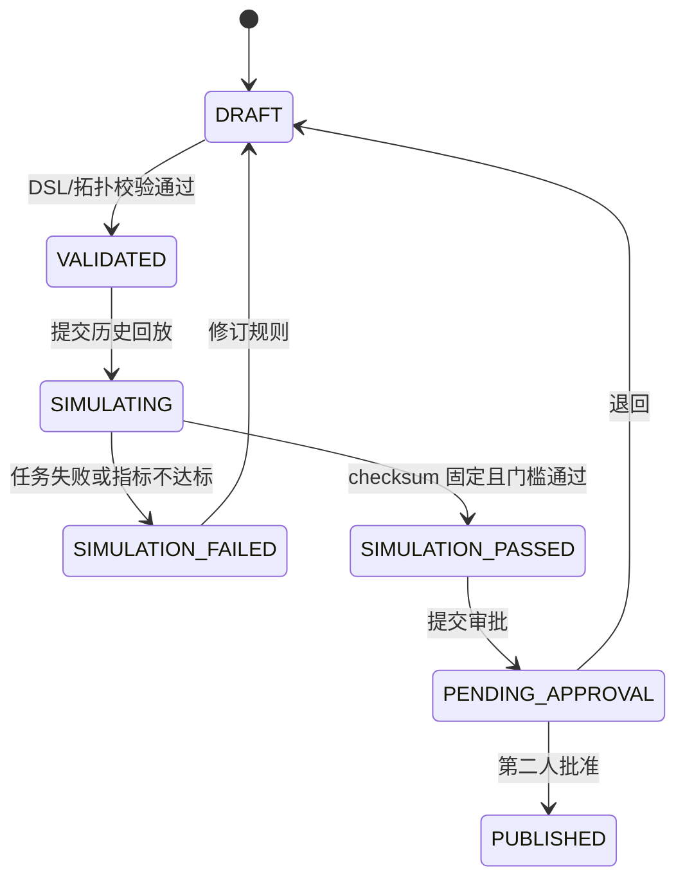
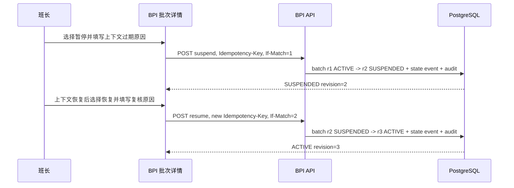
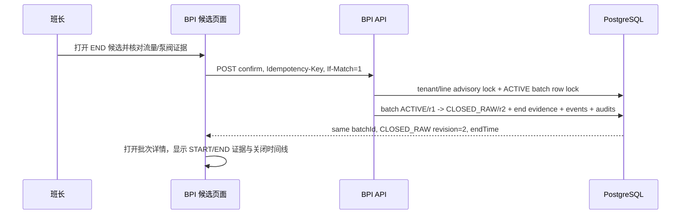
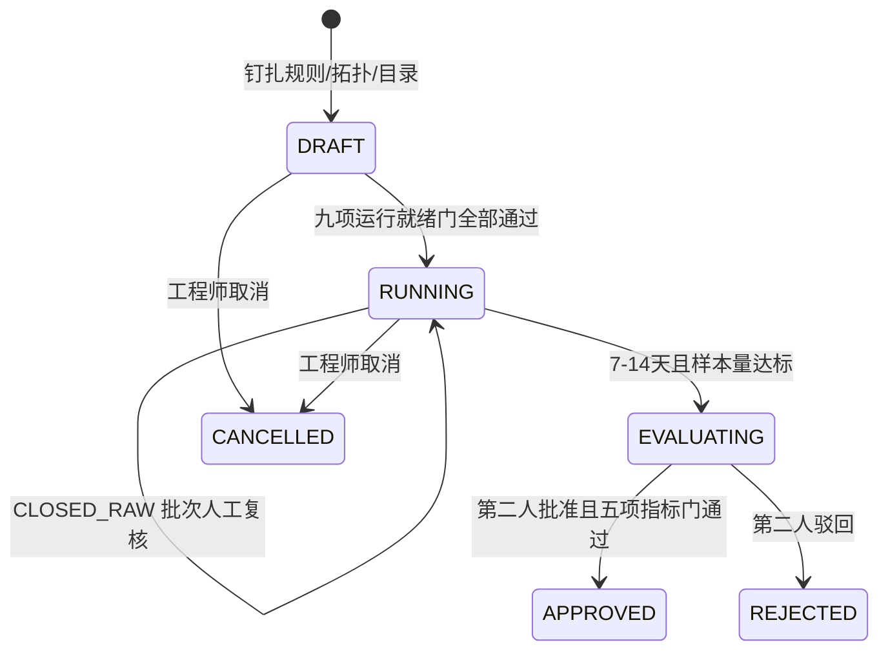

# BPI 智能批次与工艺数据中心交互设计

状态：Phase 0/1 产品交互基线
依据：`2026-07-12-batch-process-intelligence.md`、`batch-process-intelligence.md`
产品边界：嵌入现有 MES，首期只运行影子批次，不控制 PLC/DCS，不自动写 WOM/QCS/WMS。

## 1. 设计目标

BPI 的第一任务不是展示更多图表，而是帮助用户把“连续生产信号”审成“可信生产事实”。
所有关键界面围绕四个问题组织：

1. 当前生产线正在发生什么？
2. 系统为什么判断这里应该开始或结束一个批次？
3. 人工确认、拒绝或修订后留下了什么证据？
4. 这批物料如何关联生产指令、质量、库存和训练数据？

首期产品以桌面端调度室和工程师工作站为主，支持 1366px 以上视口。窄屏保留查询和审批，
拓扑编辑、规则编辑和曲线对比提示转到桌面完成。

## 2. 产品壳与信息架构

浏览器继续使用 MES 统一入口。BPI 一级菜单名称为“智能批次”，不新增独立登录页。

```text
MES 顶部标签
└─ 智能批次
   ├─ 实时生产态势       /bpi/overview
   ├─ 候选批次           /bpi/candidates
   ├─ 批次档案           /bpi/batches
   ├─ 点位准入           /bpi/points
   ├─ 工艺拓扑           /bpi/topologies
   ├─ 边界规则           /bpi/rules
   ├─ 数据质量           /bpi/data-quality
   ├─ 影子验收           /bpi/shadow-runs
   ├─ 运行开关           /bpi/feature-flags
   ├─ 训练数据集         /bpi/datasets
   ├─ 集成运行           /bpi/integrations
   └─ 审计记录           /bpi/audit
```

布局沿用现有 ADP 的紧凑型后台界面：顶部标签、左侧模块导航、主区域工具栏和数据表。
详情使用全宽页面或右侧抽屉，不把关键业务放入多层卡片。列表工具栏固定在表格上方，
图标按钮均有 tooltip；危险命令使用文本命令和二次确认。

## 3. 角色与操作边界

| 角色 | 默认首页 | 可执行命令 | 明确禁止 |
|---|---|---|---|
| 调度/班长 | 实时生产态势 | 确认/拒绝候选、暂停、恢复、申请强制结束 | 修改或发布规则 |
| 工艺工程师 | 边界规则 | 拓扑草拟、已准入测点绑定、规则草拟、模拟、创建/启动/复核/完成影子验收 | 导入点位快照、单人发布规则、批准自己创建的影子验收、修改原始事件 |
| 计量/仪表工程师 | 点位准入 | 提交证书引用、SHA-256、校准版本和有效期 | 批准自己提交的证据、改写来源快照 |
| 质量人员 | 批次档案 | 关联样品、复核质量门、提交处置意见 | 改批次边界和规则 |
| 仓储人员 | 批次档案 | 复核 WMS 回执、重查幂等单据 | 直接改 BPI 累计量 |
| 数据工程师 | 数据质量 | 数据质量处置、生成数据集快照 | 修改生产事实和质量结果 |
| 审批人 | 待审批规则/修订 | 发布规则、批准重大修订/强制结束、独立批准或驳回影子验收 | 草拟或创建后自行审批 |
| 系统管理员 | 集成运行 | 导入点位快照、集成配置、服务诊断、权限配置 | 自动获得工艺审批权 |
| BPI 管理员 | 运行开关 | 设置租户/工厂/产线覆盖、恢复上级继承 | 修改平台默认值、解除 Phase 1 锁定项 |
| 审计人员 | 审计记录 | 查询、导出审计链 | 任何业务写操作 |

权限判断同时校验 tenant、plant、line 和对象状态。页面隐藏无权限按钮只是体验处理，
后端仍执行对象级授权。权限变化后旧页面提交返回 `403`，提示“权限已变化，请刷新页面”。

## 4. 全局交互约定

### 4.1 状态颜色

| 语义 | 颜色用途 | 示例 |
|---|---|---|
| 正常/已完成 | 绿色 | ACTIVE 正常、模拟通过、数据健康 |
| 待处理/进行中 | 蓝色 | CANDIDATE、后台任务运行中 |
| 注意/降级 | 琥珀色 | 缺少非关键证据、局部曲线不可用 |
| 阻断/失败 | 红色 | required 信号失效、质量门阻断、命令失败 |
| 已停止/历史 | 灰色 | CLOSED_RAW、REJECTED、过期版本 |

颜色不作为唯一信息载体，状态必须同时显示文字和图标。

### 4.2 通用实体状态

所有页面复用统一 `EntityPanel` 行为：

| 状态 | 页面行为 |
|---|---|
| `loading` | 保留稳定布局，表头和关键区使用骨架，不整页闪白 |
| `empty` | 显示业务空态和下一动作，例如“待生产，最后心跳 10:32:04” |
| `partial` | 可用事实继续显示，受影响区域独立告警并给出重试入口 |
| `error` | 显示可理解的问题、traceId、重试和返回路径，不展示 Java 异常栈 |
| `success` | 展示数据更新时间和查询快照时间 |

### 4.3 命令反馈

- 所有命令按钮点击后立即禁用，显示进行中状态，避免双击。
- 每次命令生成 `Idempotency-Key`；页面恢复后可按 taskId 查询结果。
- 更新命令携带 `If-Match` revision。发生 `409` 时展示服务器新版本与用户当前草稿差异。
- 网络超时不直接显示失败，先按 idempotency key 查询命令结果。
- 高风险命令必须填写原因；强制结束和重大修订要求审批人。

## 5. 页面规格

### 5.1 实时生产态势 `/bpi/overview`

**用户目标：** 在一个屏幕内识别正在生产、等待确认和数据失真的产线。

页面由工厂/车间筛选条、产线状态表、工艺阶段带和异常队列组成。产线状态表固定列：

- 产线、生产指令、当前批次、工段、运行状态；
- 边界置信度、累计量、瞬时流量、波美/Brix；
- required 信号健康度、最后事件时间、待处理候选数。

点击产线打开右侧“实时证据”抽屉，包含最近 15 分钟关键点趋势、阀泵路径、当前规则条件、
已满足/未满足证据和数据质量影响。点击批次号进入批次详情；点击待处理数跳到已带筛选的候选页。

刷新采用增量轮询或 SSE，表格行不因刷新重新排序。用户切换“仅异常”后只显示有候选、
required 信号异常或上下文过期的产线。没有生产时显示最后心跳和最近一次批次，不留白页。

**主要 API：** `getBpiOverview`、`getCurrentLineState`。

### 5.2 候选批次 `/bpi/candidates`

**用户目标：** 快速判断系统提出的 START/END 边界是否可信。

默认按影响优先级排序，筛选项包括工厂、产线、边界类型、置信度、规则版本、候选状态和时间。
列表列：候选时间、产线、START/END、关联指令、置信度、证据满足数、缺失项、数据质量影响、状态。

点击一行进入候选审核工作区，左侧是时间轴和关键曲线，右侧是规则证据：

- required/quorum/optional 分组；
- 每个信号的值、单位、质量、事件时间、来源和校准版本；
- 规则版本、拓扑版本、第一法定 quorum 事件和确定性 candidate key；
- WOM 上下文及其有效期。

底部命令为“确认候选”“拒绝候选”“暂不处理”。START 的确认框显示“确认并生成影子批次”；END 的
确认框显示 `ACTIVE → CLOSED_RAW` 和“确认并关闭原始批次”。确认前显示拟生成或关闭的批次、边界时间和影响；
拒绝必须选择原因。证据不足时确认按钮降级为“提交人工确认”，要求备注并进入审计。

**冲突处理：** 第二位用户确认已处理候选时，不弹泛化错误，直接刷新为“已由某人确认”，
保留其审核备注和时间。

拒绝候选必须填写误判、上下文错误或现场处置依据。拒绝成功后候选变为 `REJECTED`，从待处理队列
移除且不得创建影子批次；同一幂等键重试返回原拒绝结果。已拒绝候选不能再被旧页面确认。

**主要 API：** `listBatchCandidates`、`getBatchCandidate`、`confirmBatchCandidate`、
`rejectBatchCandidate`。

### 5.3 批次档案 `/bpi/batches`

**用户目标：** 查询权威批次及其生产、质量、库存状态。

列表使用 cursor 分页和固定 `snapshotAt`，筛选包括批次号、指令、产线、工段、状态、质量处置、
WMS 状态、规则版本和时间范围。列：批次号、物料、产线/工段、开始/结束、累计量、干物量、
平衡差异、质量门、库存状态、当前 revision。

批次状态持续变化时不重排当前页；顶部提示有新数据，用户主动刷新查询快照。

**主要 API：** `listBatches`、`getBatch`。

### 5.4 批次详情 `/bpi/batches/{batchId}`

页面顶部固定显示批次号、状态、工段、指令、规则/拓扑版本、revision 和审计状态。内容使用标签页：

1. **概览**：时间、数量、物料、班组、质量门和 WMS 回执。
2. **边界证据**：START/END 证据、置信度、缺失/降级项和原始事件引用。
3. **工艺趋势**：关键点曲线、阶段标记和异常区间；原始库不可用时仅该标签降级。
4. **物料平衡**：输入、输出、干物、能源、估算量、分配规则和差异。
5. **批次谱系**：分流、合流、回配 DAG，支持向上/向下展开。
6. **质量与库存**：检验申请、required inspection set、处置、WMS 幂等命令和回执。
7. **修订与审计**：append-only 状态事件、修订前后差异、审批和 traceId。

允许命令根据状态显示：暂停、恢复、申请强制结束、提交修订。修订采用字段级表单，原值只读，
新值、原因、证据和影响评估必填。不会直接覆盖原批次记录。

首期已经实现的运行控制严格限定为 `ACTIVE -> SUSPENDED -> ACTIVE`。详情页在 `ACTIVE` 时只显示
“暂停自动处理”，在 `SUSPENDED` 时只显示“恢复自动处理”，其他状态不显示这两个命令。暂停与恢复
都要求原因、`Idempotency-Key` 和当前 `If-Match` revision；成功后批次 revision 加一，并追加
`BATCH_SUSPENDED` 或 `BATCH_RESUMED` 状态事件和批次审计。暂停不会结束批次、修改累计量或向
WOM/QCS/WMS 写数据；恢复也不会补造缺失事件，而是从已审计的同一批次继续自动处理。

首期 END 边界关闭也已经实现，但它仍通过候选审核入口完成，不在批次详情增加一个无证据的“结束”按钮。
END 确认要求 reason、`Idempotency-Key` 和候选 `If-Match`，并锁定同一 tenant/plant/line/order 的
`ACTIVE` 批次。成功后同一批次进入 `CLOSED_RAW`、revision 加一、写入 endTime、END 证据、
`END_BOUNDARY_CONFIRMED` 状态事件和候选/批次审计。详情页对 `CLOSED_RAW` 不再显示暂停或恢复命令。

Phase 2 的后端 projection 已提供 `getBatchRelease`，但页面尚未实施。后续“质量与库存”标签必须直接展示
quality gate external revision、每个 required inspection 的 final/disposition、WMS command 状态、回执单据号、
错误码和时间线，不得把接口 `201/200` 显示为“已放行/已入库”。`WAIT_QA` 显示待检项；`REJECTED`
显示不合格项；`RELEASED + PENDING` 显示入库处理中；只有 receipt 为 accepted 且存在 `documentId` 才显示
“已入库”。WMS rejected 保持批次 RELEASED 并显示可查单错误，不提供第二次新建入库命令的按钮。

**主要 API：** `getBatch`、`getBatchEvidence`、`getBatchBalance`、`getBatchGenealogy`、
`getBatchTimeline`、`getBatchRelease`、`suspendBatch`、`resumeBatch`、`forceCloseBatch`、
`createBatchCorrection`。

### 5.5 点位准入 `/bpi/points`

**用户目标：** 在拓扑绑定前确认 JetLinks 点位身份和运行准备度，阻止伪点位或失效点位进入规则链。

页面按工厂和产线读取当前不可变快照，顶部显示快照 ID、来源 revision、采集时间、checksum，以及
ready/blocked 数量。点位表固定展示 product、device、JetLinks 原属性、exporter 规范化属性、单位、设备状态、注册状态、属性存在性、
来源校准声明、MES 权威校准状态/有效截止时间、源序列能力和阻断原因。未取得快照时显示“尚未导入点位目录”，不生成默认绑定。

只有 `BPI_ADMIN` 可打开导入对话框。首期对话框接收 exporter 生成的 JSON 快照，要求来源实例、来源 revision、
工厂、产线、采集时间、点位清单和导入原因；提交时携带 `Idempotency-Key` 和 `If-Match: 0`。页面不允许直接
编辑快照条目，也不连接 JetLinks 数据库。现场点位变化必须由 exporter 生成新快照，旧拓扑继续保留已钉扎的
快照 ID/checksum 作为审计证据。

ready 条件必须全部满足：设备 `ACTIVE`、已注册、属性存在、单位与绑定一致、MES 校准状态为 `VERIFIED`、
设备或网关级来源 epoch/sequence 已启用，且 product/device/property 与拓扑绑定完全一致。Exporter 自增序列
只允许影子观测，不能把点位提升为 ready。任何一项不满足都显示明确 blocker，并使拓扑校验 fail closed。

来源系统的 `calibrationStatus=VERIFIED` 仅保存为审计声明。计量/仪表工程师从点位行提交证书引用、SHA-256、
校准版本和有效期；记录进入 `PENDING` 后仍不放行。非提交人的 `BPI_ADMIN` 可批准或驳回；已批准证据可撤销。
点位准入每次读取都按证据状态、当前时间、快照观测时间和有效期动态重算；未生效、过期、驳回和撤销均立即 fail closed。

**主要 API：** `listPointCatalogSnapshots`、`getCurrentPointCatalog`、`importPointCatalogSnapshot`、
`listPointCalibrations`、`submitPointCalibration`、`approvePointCalibration`、`rejectPointCalibration`、
`revokePointCalibration`。

### 5.6 工艺拓扑 `/bpi/topologies`

**用户目标：** 版本化维护工段、设备路径和测点语义。

左侧为 plant/line/stage 树，中间为二维节点与连接，右侧为选中对象属性。节点类型包括工段、罐、
泵、阀、meter 和逻辑边界。工具栏提供选择、连接、校验、版本对比、保存草稿、提交审批。

测点绑定表列出 JetLinks product/device/property、语义、单位、优先级、校准版本和 locality group。
发布前校验 required 信号缺失、路径悬空、共享 meter 未分配和循环批次谱系风险，并逐项与当前点位准入快照
核对设备激活/注册、属性存在、单位和校准状态。校验通过后拓扑记录快照 ID/checksum；没有快照或点位不 ready
时禁止发布，不允许用前端默认值绕过。

拓扑发布后不可修改；从已发布版本复制新草稿。正在运行的批次继续固定引用旧版本。

**主要 API：** `listTopologies`、`getTopologyVersion`、`createTopologyDraft`、
`compareTopologyVersions`、`validateTopologyDraft`、`publishTopologyVersion`。

### 5.7 边界规则 `/bpi/rules`

**用户目标：** 使用受控 DSL 配置多信号批次边界并通过回放后发布。

规则列表显示规则编码、适用工段、版本、状态、拓扑版本、最近模拟结果和发布人。规则编辑器采用
条件组而非自由脚本：信号、比较符、阈值、持续时间、required/quorum/optional、迟到窗口、
静默时间和 penalty。右侧持续显示生成的只读 AST 与校验结果。

“模拟”打开参数抽屉，选择产线、时间范围、拓扑/校准版本和黄金批次集。结果页对比自动边界与人工边界，展示命中、漏判、误判、时间偏差、
累计量差异和 checksum。只有模拟 `PASSED` 且 checksum 与当前草稿一致时才能提交发布。

发布使用双人审批。规则版本发布后不可修改；新版本通过复制产生。

首期已实现“规则与拓扑”合并工作台：规则列表和当前已发布拓扑/测点绑定同屏展示；规则详情展示受控 AST、
作用域、revision、规则 checksum，以及最近回放的观测值数量、金标准边界数、命中/漏检/误报、平均时间偏差、
发射边界和 simulation checksum。回放当前为 30 秒事务内的有界同步操作，最多 100,000 个观测值；后续超过
该规模时再拆为持久化后台任务。页面只在 `SIMULATION_PASSED` 且最近模拟为 `PASSED` 时显示“提交审批”；
进入 `PENDING_APPROVAL` 后显示审批人、提交时间以及“管理员批准并发布/管理员驳回”。

当前 Phase 1 后端已实现 checksum/revision/幂等/作用域技术门、不可变审批申请和双人职责分离：提交人可为
工程师或管理员，最终批准人必须是同时不同于规则创建人和提交人的管理员；驳回会退回草稿并要求重新模拟。
页面还会自动选择同 code/同作用域的另一版本，展示拓扑引用和 AST 的稳定 JSON Pointer 差异。

规则详情把业务规则状态与发布链路状态分开显示，并展示本轮尝试、累计尝试、人工重试、发布修订、最近重新入队时间、
Kafka 确认时间和最后错误。只有发布链路进入 `FAILED` 才显示“管理员重新入队”；操作要求原因、幂等键和发布 revision，
成功后回到 `PENDING`，不会改写规则业务 revision，也不会把 Kafka 确认误标为 Flink 已生效。

规则列表和详情进一步把 Kafka 分发与 Flink 运行态应用拆开：`WAITING` 表示仍无应用回执，`REJECTED` 展示 deployment、
观察/接收时间、错误码和原因，`APPLIED` 才显示为在线已应用。完全相同或终态后的回执不重复推进 revision；页面不得以
规则业务 `PUBLISHED` 或 Kafka `PUBLISHED` 代替 Flink `APPLIED`。确定性浏览器测试已覆盖
`WAITING -> REJECTED -> APPLIED`，但该模拟证据不替代真实 Kafka/Flink checkpoint/restart 验收。

**主要 API：** `listRules`、`getRuleVersion`、`compareRuleVersions`、`createRuleDraft`、`simulateRule`、
`getRuleSimulation`、`submitRuleApproval`、`rejectRuleApproval`、`publishRuleVersion`、
`retryRulePublication`、`retireRuleVersion`。

规则详情同时展示生命周期动作、序号和期望在线状态。管理员只有在激活事件已经取得 Kafka、Flink
和运行态证据后才能执行退役；退役后页面持续显示停用事件的分发、应用与 `INACTIVE` 进度。
已退役版本提供“创建回滚草稿”，预填历史 AST 与拓扑，但仍必须以新版本重新完成回放、审批和发布。

目标环境页面/API/PostgreSQL 的版本比较、提交审批、同 actor 拒绝、独立批准和独立驳回证据见
[`bpi-rule-version-lifecycle-acceptance.md`](../testing/bpi-rule-version-lifecycle-acceptance.md)。该证据只闭合
控制面，不替代规则退役、typed inactive、broker/Flink 应用和产品级回滚。

### 5.8 数据质量 `/bpi/data-quality`

按“影响批次优先”而非按原始事件数量排序。顶部汇总 required 信号不可用、时钟漂移、单位未知、
序列断点、共享 meter 未分配和缓冲区告警。列表按 source+point+issue 聚合，显示持续时间、
事件数、影响产线/规则/批次、当前责任人和处置状态。

详情抽屉展示首次/最近事件、质量时间轴、影响分析和推荐动作。确认、分派、解决均要求备注；
解决不会删除原事件。列表使用服务端聚合、固定 `snapshotAt` 截点和 HMAC scope-bound keyset cursor；
截点后发生变化的事件不混入旧游标，操作员刷新后读取最新队列。页面按 cursor 增量加载并按 incident ID
去重，不使用页码推断实时事件位置，也不把实时工作队列冒充历史版本快照。

**主要 API：** `listDataQualityIncidents`、`getDataQualitySummary`、`getDataQualityIncident`、
`acknowledgeDataQualityIncident`、`resolveDataQualityIncident`。

### 5.9 影子验收 `/bpi/shadow-runs`

首屏是可扫描的验收队列，不是大屏。顶部按状态筛选；每行显示运行编码、产线、钉扎规则版本、
计划时长、已复核批次、边界认同率、累计量偏差和 blocker 数。创建时只允许选择当前作用域内的
`PUBLISHED` 规则，系统自动钉扎其已发布拓扑和校验时的点位目录；最短时长限制为 7-14 天，最少
10 批，边界人工认同率不能低于 95%。

详情抽屉分为四块：不可变版本证据、9 个运行前准入门、5 个批准指标门、批次复核记录。启动按钮只有在
规则业务发布、Kafka 发布、Flink `APPLIED`、运行态 `READY`、拓扑发布且仍钉扎 current operational
point catalog 时可用。批次复核只列出同 scope、同规则/拓扑版本、运行窗口内的 `CLOSED_RAW` 影子批次；
保存自动/人工起止时间、边界偏差、自动/参考量、单位和原因。重复复核不覆盖历史，旧记录标记
`SUPERSEDED`。

达到时长和样本量后，工程师将运行推进到 `EVALUATING`。批准按钮只对管理员开放，且管理员不能是创建人；
边界认同率、累计量偏差或 CRITICAL 数据质量任一不达标都显示业务说明与原始 blocker code，并返回 422。
驳回和取消都要求原因。批准只改变 BPI 验收状态，不自动写 WOM、QCS、WMS，也不控制 PLC/DCS。

**主要 API：** `listShadowRuns`、`createShadowRun`、`getShadowRun`、
`listShadowRunBatchReviews`、`reviewShadowRunBatch`、`startShadowRun`、`completeShadowRun`、
`approveShadowRun`、`rejectShadowRun`、`cancelShadowRun`。

### 5.10 训练数据集 `/bpi/datasets`

数据集定义列表显示特征版本、标签版本、prediction time、允许批次状态、排除规则和最近快照。
创建快照时选择冻结时间、工厂/产线/工段、规则版本和数据范围。预检必须显示：低置信度批次数、
人工修订数、缺标签数、未来信息泄漏风险和估算输出规模。

快照为后台任务，页面关闭后继续。结果展示 manifest、checksum、Iceberg snapshot、MLflow run、
排除统计和下载入口。已发布快照不可覆盖。

**主要 API：** `listDatasets`、`createDatasetSnapshot`、`getDatasetSnapshot`。

### 5.11 集成运行 `/bpi/integrations`

展示 JetLinks exporter、Kafka、Flink、WOM、QCS、WMS、TimescaleDB、PostgreSQL 和 MinIO 的健康、
最后成功时间、lag、spool 使用率和降级影响。健康值与业务影响分开：例如 TimescaleDB 曲线不可用
不阻断批次事实查询；WOM 上下文过期会阻断自动确认。

管理员可执行连通性检查和查看脱敏配置，不在页面显示凭据。首期不提供 PLC 写命令。

**主要 API：** `getIntegrationHealth`、`runIntegrationCheck`。

### 5.12 运行开关 `/bpi/feature-flags`

页面首屏显示 6 个受控开关的“当前有效值、有效来源、选中层覆盖、执行状态和最近变更”，不能只显示一列
布尔值。管理员先指定具体工厂和产线作为解析目标，再选择 TENANT、PLANT 或 LINE 作为编辑层；切换编辑层
不改变解析目标。`SET` 创建显式启用/禁用覆盖，`INHERIT` 只停用当前层覆盖并恢复上级解析，均要求不少于
8 个字符的变更依据、`Idempotency-Key` 和当前覆盖 `If-Match` revision。

`bpi.commands` 与 `bpi.rule-management` 由 Java 17 服务真实执行，允许管理员变更；`bpi.shadow-only`、
`bpi.auto-confirm`、`bpi.wms-link` 显示锁定原因且没有操作按钮。`bpi.ui` 由 Java 8 adapter 在旧 MES
`/inter-api/rbac/v1/menus/currentUser` 原生菜单读取点真实执行：有效值为 true 时只注入一个“智能批次”
菜单及工作台子项，为 false、scope 拒绝、开关缺失或服务异常时移除 BPI 菜单并失败关闭；Nginx 在 adapter
进程不可用时回退 gateway 原菜单合同。该开关只控制导航可见性，不替代 API 授权。固定
`/bpi/#/featureFlags` 直达入口作为管理员恢复路径，避免错误配置造成自锁。409 冲突时页面刷新服务器
revision，403 保留后端权限结论，422 显示阶段门禁原因。所有成功变更必须同时产生功能开关审计和幂等
完成记录。

**主要 API：** `listFeatureFlags`、`changeFeatureFlagOverride`。

### 5.13 审计记录 `/bpi/audit`

按 batchId、candidateKey、ruleVersion、user、action、traceId 和时间查询。记录显示命令输入摘要、
前后 revision、审批链、API 状态和关联 outbox/inbox。原始敏感 payload 默认折叠并按权限脱敏。

**主要 API：** `listAuditEvents`、`getAuditEvent`。

## 6. 核心流程

### 6.1 候选确认到影子批次



### 6.2 规则模拟与发布



### 6.3 批次暂停与恢复



### 6.4 END 边界关闭原始批次



### 6.5 影子运行到独立批准



## 7. 异常与恢复

| 场景 | 用户看到 | 可恢复动作 |
|---|---|---|
| 同一候选被他人处理 | 最新处理人、结果、时间和备注 | 打开已生成批次 |
| revision 过期 | 字段级差异和服务器最新值 | 合并后重新提交 |
| 命令超时 | “结果确认中”而非直接失败 | 按 idempotency key 查询 |
| 曲线库不可用 | 详情事实可用，曲线标签局部错误 | 重试曲线，不刷新整页 |
| WOM 上下文过期 | 自动确认关闭并显示影响规则 | 刷新上下文或人工审核 |
| QCS 不可用 | 批次停留 WAIT_QA | 查看重试和 incident |
| WMS 回执超时 | 显示查单中，禁止再次创建 | 按 key 查单后再重试 |
| 规则模拟服务重启 | 后台 task 状态恢复 | 继续查看同一 taskId |
| 无当前批次 | “待生产”和最后心跳 | 查看最近批次 |

## 8. 可访问性与效率

- 所有主流程可用键盘完成，焦点顺序与视觉顺序一致。
- 表格支持固定表头、列显隐、密度切换和可复制批次号。
- 图表/拓扑提供同等信息的表格视图，颜色异常有文字标签。
- 关键按钮不只用颜色区分；危险操作不与普通保存相邻。
- 页面保留用户筛选和返回位置，详情返回不会丢失列表上下文。
- 10,000 行以上使用服务端聚合、cursor 分页和虚拟渲染。

## 9. Phase 1 模拟验收范围

首批模拟器必须覆盖：

1. 查询实时产线状态和待处理 START 候选。
2. 读取候选证据并确认，生成唯一影子批次。
3. 使用相同 `Idempotency-Key` 重试不重复生成批次。
4. 使用旧 revision 再提交返回 `409` 和当前 revision。
5. START 后出现 END 候选；确认后同一批次进入 `CLOSED_RAW/r2`，显示 endTime、独立 END 证据和
   `END_BOUNDARY_CONFIRMED`，且不再显示暂停/恢复按钮。
6. 独立场景从批次详情暂停 `ACTIVE` 批次，看到 `SUSPENDED/r2`、产线 `BLOCKED` 和追加事件。
7. 从同一详情恢复批次，看到 `ACTIVE/r3`、产线 `RUNNING` 和追加事件。
8. 查询批次详情、START/END 证据、平衡和谱系。
9. 查询无点位快照状态；导入并重放不可变点位目录快照，页面展示 ready/blocker。
10. 导入来源自声明 VERIFIED 的点位，验证它在 MES 证据批准前仍为 BLOCKED。
11. 提交、独立批准和撤销校准证据，验证点位按 `BLOCKED -> READY -> BLOCKED` 动态转换。
12. 绑定 ready 点位后校验拓扑，展示并持久化点位快照 ID/checksum；缺失或不合格点位必须阻断发布。
13. 提交规则模拟，得到可复现 checksum，并以该 simulation 发布规则。
14. 查询数据质量事件并看到受影响的产线、规则和批次。
15. 创建并启动钉扎 PUBLISHED/APPLIED/READY 和 operational point catalog 的 7 天影子验收。
16. 复核 10 个 `CLOSED_RAW` 影子批次，得到精确 95% 边界认同率和合格累计量偏差。
17. 证明未解决 CRITICAL 数据质量事件以 `UNRESOLVED_CRITICAL_DATA_QUALITY` 阻断批准，处置后再评估。
18. 由不同于创建人的管理员批准，验证 revision 和审计推进，且 `externalWrites=false`。

模拟验收不证明真实 JetLinks、Kafka、Flink 或 PostgreSQL 已接通；真实环境仍需执行
浏览器、API、PostgreSQL marker 和回滚验收。模拟器对 7 天时钟采用确定性时间压缩，不得作为现场
连续 7-14 天运行证据。
