# FT MES + BPI 当前项目地址与产品交互说明书

文档版本：`1.0`

编制日期：`2026-07-24`

实现基线：`007616b290efa366f97e99cb27efb68c8186268c`

运行基线：唯一 ADP 测试栈 `adp-mes-newbase`，PostgreSQL 15.18，BPI Flyway V35

产品状态：`IN_PROGRESS_NOT_COMPLETE`

本文是当前可运行产品的入口和交互说明。它描述已经存在的页面、命令、API、状态和落库边界，
同时明确仍属于规划或生产准入缺口的内容。权威接口仍以
[`contracts/bpi-api/openapi.json`](../../contracts/bpi-api/openapi.json) 为准，权威完成度以
[`docs/project-goal-acceptance.md`](../project-goal-acceptance.md) 为准。

## 1. 项目地址

### 1.1 代码仓库与本机目录

| 类型 | 地址 | 用途 | 当前说明 |
| --- | --- | --- | --- |
| MES GitHub | <https://github.com/MapleTcT/ft-mes> | FT MES、ADP 恢复代码、BPI、部署与验收资产 | 正式远端仓库 |
| IoT GitHub | <https://github.com/MapleTcT/iot> | JetLinks、MQTT、点位目录和来源序列证据 | BPI 数采上游 |
| MES 主工作区 | `/Users/zhangchu/Documents/ADP/adp-source-repo` | 本机 `main` 工作树 | 保留既有用户改动，不作为当前 BPI 开发工作树 |
| 当前 BPI 工作区 | `/Users/zhangchu/Documents/ADP/adp-bpi-live-operations` | 当前 BPI 实现、文档和验收 | 当前开发分支 `codex/bpi-next-goal` |
| IoT 工作区 | `/Users/zhangchu/Documents/ADP/iot` | 当前 MQTT/JetLinks 接入实现 | 分支 `codex/bpi-mqtt-ingress-v1` |
| 备用 IoT 克隆 | `/Users/zhangchu/Documents/codex/iot-proj/iot` | 另一份 IoT 克隆 | 使用前先核对分支，不能与当前工作区混用 |
| 原始 ADP 包 | `/Users/zhangchu/Downloads/ADP` | Windows ADP 基础包来源 | 只作为恢复来源，不是持续开发仓库 |
| MES 模块包 | `/Users/zhangchu/Documents/MES包` | 生产、质量、设备等模块来源 | 新包进入前先执行模块准入扫描 |
| PATROL 包 | `/Users/zhangchu/Documents/supPlant-Patrol V6.0.4.0-210616-C` | 共享巡检模块来源 | 已恢复并纳入当前仓库 |
| EMS 包 | `/Users/zhangchu/Documents/supEMS V6.0.4.0-210617-C` | 能源模块来源 | 仍缺 Indicator 依赖 |
| 测试机 ADP 部署目录 | `/home/v6/adp-mes-docker-newbase-20260611-181921/deploy/docker` | 唯一 ADP Compose 工作目录 | 容器 label 实时核对 |
| 测试机 BPI 流处理目录 | `/home/v6/adp-bpi-stream-v15/deploy/bpi-streaming` | Kafka/Flink/MinIO Compose 工作目录 | 容器 label 实时核对 |

### 1.2 测试环境入口

以下地址于 `2026-07-24` 实际连通验证。

| 使用者 | 入口 | 地址 | 当前结果 |
| --- | --- | --- | --- |
| 公司内网用户 | ADP/MES 登录与统一门户 | <http://10.11.100.17:18080/> | HTTP 200 |
| 公司内网用户 | BPI 操作台默认页 | <http://10.11.100.17:18080/bpi/#/overview> | HTTP 200 |
| 外出/VPN 用户 | ADP/MES 登录与统一门户 | <http://100.99.133.43:18080/> | HTTP 200 |
| 外出/VPN 用户 | BPI 操作台默认页 | <http://100.99.133.43:18080/bpi/#/overview> | HTTP 200 |
| 公司内网运维 | SSH | `ssh v6@10.11.100.17` | 可连接 |
| 外出/VPN 运维 | SSH | `ssh v6@100.99.133.43` | 可连接 |
| 运维人员 | ADP Gateway 健康 | <http://10.11.100.17:18008/actuator/health> | HTTP 200 |
| BPI 运维人员 | Java 8 adapter 健康 | <http://10.11.100.17:19080/actuator/health> | `UP` |
| BPI 运维人员 | Java 17 service 健康 | <http://10.11.100.17:19091/actuator/health> | `UP` |
| WMS 运维人员 | BPI WMS adapter 健康 | <http://10.11.100.17:19092/actuator/health> | `UP` |
| 流处理运维人员 | Flink Web/REST | <http://100.99.133.43:18081/> | HTTP 200，当前作业 36/36 RUNNING |

访问约定：

- 业务用户只使用 `18080` 的 ADP/MES 和 BPI 页面。
- `18008`、`19080`、`19091`、`19092` 和 `18081` 是诊断入口，不是业务前端。
- BPI 复用同一浏览器中的 ADP 登录票据，不提供独立登录页。
- 密码、内部 JWT 密钥、数据库凭据和对象存储凭据不得写入本文或前端。
- 直接访问 BPI 深链接前，应先在同一地址完成 ADP 登录。

### 1.3 当前运行编排

| Compose project | 职责 | 当前主要组件 |
| --- | --- | --- |
| `adp-mes-newbase` | 唯一 ADP/MES 测试栈 | Nginx、Gateway、PostgreSQL、平台服务、WOM、QCS、material-wms、BPI service/adapter/WMS adapter |
| `ft-mes-bpi-streaming` | BPI 流处理侧车 | Kafka 三 broker、Flink JobManager、两个 TaskManager、checkpoint MinIO、MES context outbox |

Polaris、Iceberg publisher、Parquet materializer、Object Lock archiver、MLflow 和 registrar
是受控验收侧车，默认关闭，不能因为代码存在就当作常驻生产服务。

## 2. 产品范围

FT MES 当前由四层组成：

| 层级 | 产品职责 | 当前状态 |
| --- | --- | --- |
| ADP 平台层 | 登录、组织、人员、岗位、RBAC、菜单、待办、系统配置、流程、打印、文件和审计 | 基础主流程已达到 READY |
| MES 业务层 | 制造指令、备料、投料、报工、请检、质量处置、入库、追溯、巡检、设备和能源 | 生产/质量/WMS 部分闭环；巡检部分闭环；能源仍有依赖缺口 |
| BPI 智能批次层 | 点位准入、规则、候选、影子批次、数据质量、质量/WMS 链接和训练数据治理 | Phase 1/2、Phase 3A 至 3C-G 软件链已闭合，生产准入未完成 |
| IoT 数采层 | MQTT、JetLinks、点位目录、来源序列、Kafka 遥测事件 | 受控测试链已闭合，物理设备和正式计量仍待现场验收 |

MES 的业务目标链是：

```text
制造指令 -> 投料/报工 -> 请检 -> 合格/不合格处置 -> 完工入库 -> 批次追溯
```

BPI 在该链中负责把连续过程信号转换为可审核的批次事实，不替代 WOM、QCS 或 WMS 的业务所有权。

## 3. 产品原则

1. **先形成可信事实，再做自动决策。** 当前以影子批次为默认模式。
2. **失败关闭。** 点位、校准、来源序列、生产上下文或数据质量不满足时，不生成生产结论。
3. **事实不可覆盖。** 原始事件、边界证据、状态事件、审计、数据集快照和终态制品均保留版本。
4. **四眼审批。** 规则发布、校准批准、强制结束、影子验收和 WMS 冲销不能由创建人单独批准。
5. **页面成功不等于业务完成。** HTTP 200/202 只表示请求被接受，最终状态必须由业务状态和数据库事实确认。
6. **精确版本。** 拓扑、规则、点位目录、校准、Parquet 对象版本、Iceberg snapshot 和 MLflow input 必须可追溯。
7. **不控制 PLC/DCS。** 当前 BPI 只读过程信号，不向 PLC/DCS 写控制命令。
8. **生产开关默认关闭。** QCS/WMS、自动确认、训练、模型、推理和生产激活均需独立准入。

## 4. 系统交互架构

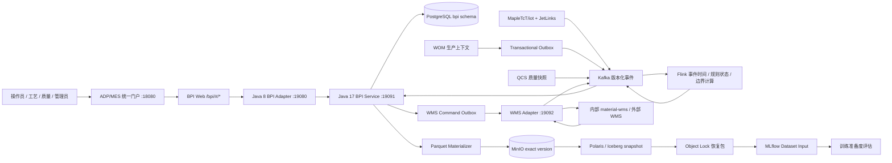

浏览器只调用同源 `/bpi-api`。Java 8 adapter 校验旧平台会话并签发短期内部 JWT，
Java 17 service 再执行 tenant、plant、line、角色和功能开关授权。浏览器不能自报可信作用域。

## 5. 用户角色

| 角色 | 主要页面 | 允许操作 | 不能操作 |
| --- | --- | --- | --- |
| 调度/班长 | 实时态势、候选、批次 | 确认/拒绝候选、暂停/恢复、申请强制结束 | 修改或发布规则 |
| 工艺工程师 | 规则与拓扑、影子验收 | 建拓扑、建规则、模拟、提交审批、创建和复核影子运行 | 批准自己创建的对象 |
| 计量/仪表工程师 | 点位目录 | 提交正式校准证据 | 批准自己提交的证据 |
| 质量人员 | 批次档案、质量状态 | 复核必检项、质量处置和放行事实 | 修改批次边界 |
| 仓储人员 | 批次档案 | 查看入库/冲销状态和持久单据 | 直接修改 BPI 累计量 |
| 数据工程师 | 数据质量、数据集清单 | 处置数据问题、生成数据集、请求受控制品 | 绕过训练门槛 |
| BPI 管理员 | 全部治理页 | 独立审批、运行开关、受控重试与恢复 | 绕过对象状态和职责分离 |
| 审计人员 | 只读证据 | 查询审计、导出证据 | 业务写操作 |

按钮可见性只用于改善体验。后端仍会在每次命令时重新授权，旧页面上的过期权限必须返回 `403`。

## 6. 当前前端信息架构

BPI 当前实现九个稳定 hash 路由：

| 页面 | 公司内网深链接 | 主要角色 | 当前实现状态 |
| --- | --- | --- | --- |
| 实时生产态势 | <http://10.11.100.17:18080/bpi/#/overview> | 调度、班长 | 目标环境已验收 |
| 候选批次 | <http://10.11.100.17:18080/bpi/#/candidates> | 调度、班长 | START/END 真实受控链已验收 |
| 批次档案 | <http://10.11.100.17:18080/bpi/#/batches> | 生产、质量、仓储 | 质量、入库、冲销受控链已验收 |
| 影子运行验收 | <http://10.11.100.17:18080/bpi/#/shadowRuns> | 工艺、管理员 | 状态机已验收；现场 7-14 天未完成 |
| 数据质量 | <http://10.11.100.17:18080/bpi/#/dataQuality> | 数据工程师、工艺 | Kafka/PostgreSQL/页面已验收 |
| 点位目录 | <http://10.11.100.17:18080/bpi/#/points> | 仪表、管理员 | 治理已验收；正式现场证书未完成 |
| 规则与拓扑 | <http://10.11.100.17:18080/bpi/#/rules> | 工艺、管理员 | 版本、模拟、审批、发布、退役已验收 |
| 数据集清单 | <http://10.11.100.17:18080/bpi/#/datasets> | 数据工程师 | 已到 Parquet v2/Iceberg；训练仍 BLOCKED |
| 运行开关 | <http://10.11.100.17:18080/bpi/#/featureFlags> | BPI 管理员 | SET/INHERIT 和旧菜单门禁已验收 |

当前实现与早期设计的差异：

- “工艺拓扑”已合并到“规则与拓扑”页面，没有独立 `#/topologies` 页面。
- “集成运行”和“审计记录”已有接口规划，但当前没有独立前端路由。
- 批次详情通过右侧抽屉打开，不使用独立 `/batches/{id}` 浏览器路由。
- 浏览器路由是 `#/overview` 形式，不是早期文档中的 `/bpi/overview`。

## 7. 全局交互规则

### 7.1 页面壳

- 左侧是九个固定导航项，顶部是工厂选择、数据快照时间和刷新按钮。
- 详情在右侧抽屉中显示，写命令使用模态对话框。
- `overview` 每 5 秒静默刷新；其他页面由用户刷新或操作后局部刷新。
- 工厂、产线、筛选和编辑层写入浏览器 `localStorage`，不作为服务端可信作用域。
- 窄屏允许查询和审批；复杂拓扑 JSON、规则 AST 和数据集窗口编辑建议使用桌面端。

### 7.2 命令协议

所有写操作使用：

| Header | 作用 |
| --- | --- |
| `Authorization` | ADP 登录票据，由 adapter 验证 |
| `Idempotency-Key` | 防止超时、双击和重试产生重复事实 |
| `If-Match` | 当前对象 revision，阻止旧页面覆盖新状态 |
| `Content-Type: application/json` | 结构化命令和原因 |

主要错误语义：

| HTTP | 页面处理 |
| --- | --- |
| `401` | 登录过期，返回 ADP 登录 |
| `403` | 权限或作用域不足，保留后端结论 |
| `409` | revision 冲突，刷新服务器版本后重新操作 |
| `422` | 业务门槛不满足，显示 blocker，不伪装成系统错误 |
| `428` | 缺少幂等键或 revision 前置条件 |
| `5xx`/超时 | 显示 traceId，并按幂等键查询结果，不能直接重复创建 |

### 7.3 状态展示

- 颜色必须同时配文字，不能只依赖红绿。
- 加载时保持表头和布局稳定。
- 空态必须说明业务原因，例如“当前没有生产上下文”，不能留整页空白。
- 局部接口失败只降级对应区域，批次基本事实仍应可读。
- 页面不得显示 Java 异常堆栈或数据库 SQLGrammarException。

## 8. 页面交互规格

### 8.1 实时生产态势

**目标：** 一个屏幕判断哪条产线正在运行、哪里有候选、哪里存在数据阻断。

**主要内容：**

- 产线、生产指令、当前批次、工段和运行状态。
- 边界置信度、累计量、瞬时流量、波美/Brix。
- required 信号健康、最后事件时间、待处理候选数。
- “仅异常”筛选。
- 点击产线打开“实时证据”抽屉，显示 PostgreSQL 最新事实、最近样本、服务端判据和未解决事件。

**API：**

- `GET /bpi-api/overview`
- `GET /bpi-api/lines/{lineId}/current-state`
- `GET /bpi-api/lines/{lineId}/live-evidence`

**主要落表：**

- `bpi.bpi_telemetry_point_latest`
- `bpi.bpi_telemetry_points`
- `bpi.bpi_batch_instances`
- `bpi.bpi_batch_candidates`
- `bpi.bpi_data_quality_incidents`

**当前边界：** V35 受控遥测已在页面显示真实 PostgreSQL 值；没有生产上下文时必须显示
`BLOCKED/WARN`，不能补造运行状态。

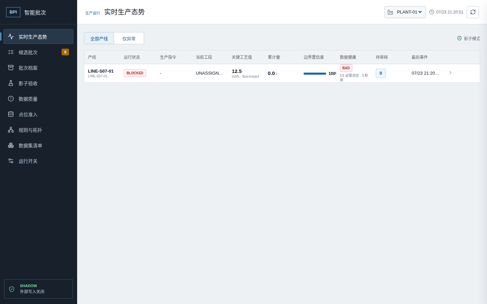

### 8.2 候选批次

**目标：** 审核系统识别的 START/END 边界。

**主要内容：**

- 候选时间、产线、边界类型、关联指令、置信度、证据满足数、缺失项和状态。
- 详情显示 required/quorum/optional 信号、值、单位、质量、事件时间、来源、校准和规则/拓扑版本。
- START 确认创建唯一影子批次。
- END 确认关闭同一活动批次为 `CLOSED_RAW`。
- 拒绝必须填写误判或现场处置依据，不创建批次。

**API：**

- `GET /bpi-api/candidates`
- `GET /bpi-api/candidates/{candidateId}`
- `POST /bpi-api/candidates/{candidateId}/confirm`
- `POST /bpi-api/candidates/{candidateId}/reject`

**主要落表：**

- `bpi.bpi_batch_candidates`
- `bpi.bpi_batch_instances`
- `bpi.bpi_boundary_evidence`
- `bpi.bpi_batch_state_events`
- `bpi.bpi_api_idempotency`
- `bpi.bpi_audit_events`

**冲突规则：** 已被其他人处理的候选刷新为最终状态；旧 revision 不能再次确认。

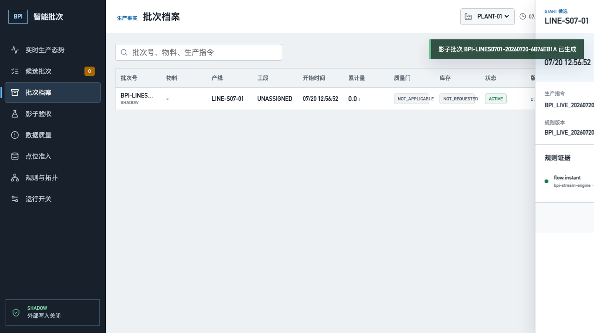

### 8.3 批次档案

**目标：** 查询批次从边界事实到质量、库存和冲销的完整状态。

**主要内容：**

- 批次号、物料、产线/工段、开始/结束、数量、质量门、WMS 状态和 revision。
- 抽屉展示 START/END 证据和 append-only 时间线。
- `ACTIVE -> SUSPENDED -> ACTIVE` 暂停/恢复。
- 无 END 候选时可申请双人强制结束。
- 质量状态显示 required inspections、外部 revision 和处置。
- WMS 显示原 command identity、幂等键、蓝单/红单、durable document 和回执。

**API：**

- `GET /bpi-api/batches`
- `GET /bpi-api/batches/{batchId}`
- `GET /bpi-api/batches/{batchId}/evidence`
- `GET /bpi-api/batches/{batchId}/timeline`
- `GET /bpi-api/batches/{batchId}/release`
- `POST /bpi-api/batches/{batchId}/suspend`
- `POST /bpi-api/batches/{batchId}/resume`
- `GET|POST /bpi-api/batches/{batchId}/force-close`
- `POST /bpi-api/batches/{batchId}/wms/reconcile`
- `GET|POST /bpi-api/batches/{batchId}/wms/reversal`

**主要落表：**

- `bpi.bpi_batch_instances`
- `bpi.bpi_batch_state_events`
- `bpi.bpi_boundary_evidence`
- `bpi.bpi_batch_force_close_tasks`
- `bpi.bpi_quality_gates`
- `bpi.bpi_quality_links`
- `bpi.bpi_wms_inbound_links`
- `bpi.bpi_wms_inbound_reversal_tasks`
- `bpi.bpi_outbox_events`
- `bpi.bpi_audit_events`

**关键状态：**

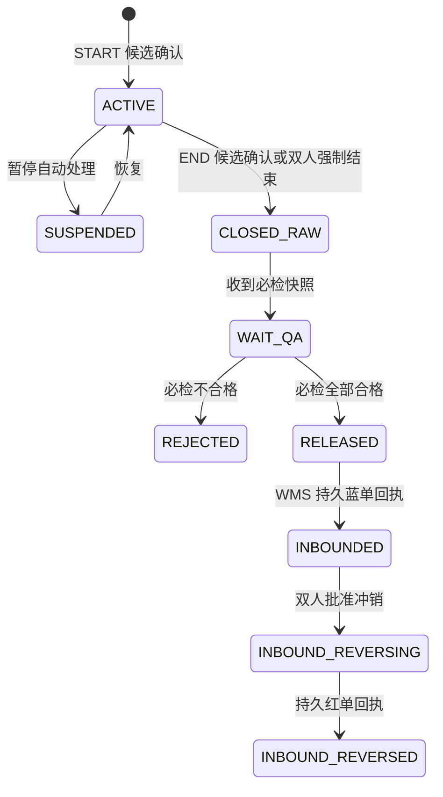

HTTP 成功不等于已入库。只有 accepted receipt 且存在 durable `documentId` 才显示“已入库”。

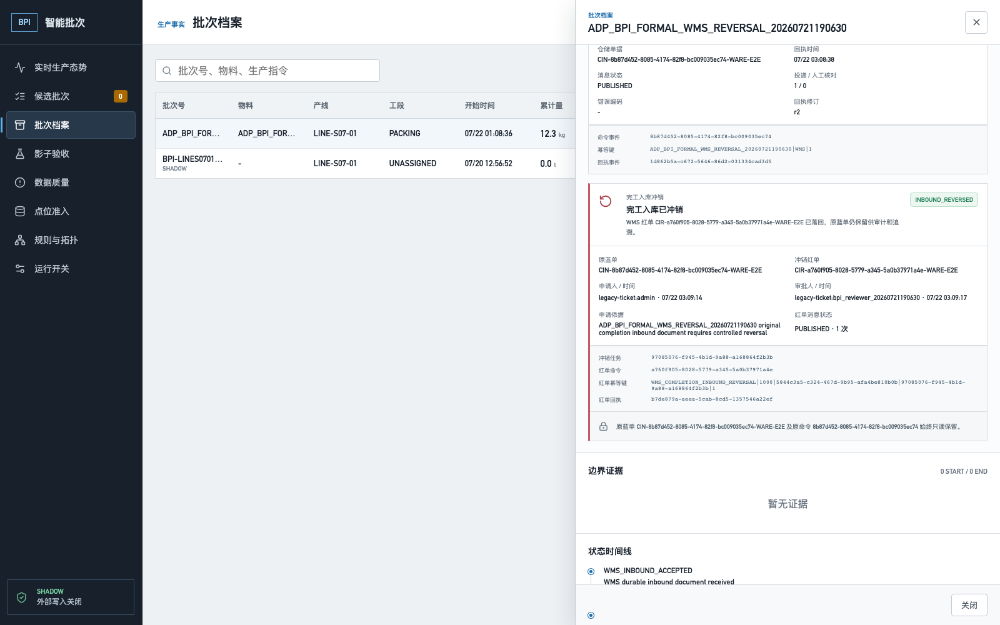

### 8.4 影子运行验收

**目标：** 在不写生产系统的前提下，用人工复核证明规则是否可以进入下一阶段。

**主要内容：**

- 创建时钉扎 PUBLISHED 规则、拓扑、点位目录和验收门槛。
- 启动前检查发布、Flink APPLIED、运行态 READY、拓扑和当前 operational point catalog。
- 逐批录入人工起止时间、参考数量、单位和依据。
- 达到时长和样本量后进入 `EVALUATING`。
- 不同于创建人的管理员批准或驳回。

**API：**

- `GET|POST /bpi-api/shadow-runs`
- `GET /bpi-api/shadow-runs/{runId}`
- `GET|POST /bpi-api/shadow-runs/{runId}/batch-reviews`
- `POST /bpi-api/shadow-runs/{runId}/start`
- `POST /bpi-api/shadow-runs/{runId}/complete`
- `POST /bpi-api/shadow-runs/{runId}/approve`
- `POST /bpi-api/shadow-runs/{runId}/reject`
- `POST /bpi-api/shadow-runs/{runId}/cancel`

**主要落表：**

- `bpi.bpi_shadow_runs`
- `bpi.bpi_shadow_run_batch_reviews`
- `bpi.bpi_data_quality_incidents`
- `bpi.bpi_api_idempotency`
- `bpi.bpi_audit_events`

**当前边界：** 受控时间压缩已证明状态机；真实产线连续 7-14 天仍未完成，不能把测试批准视为生产批准。

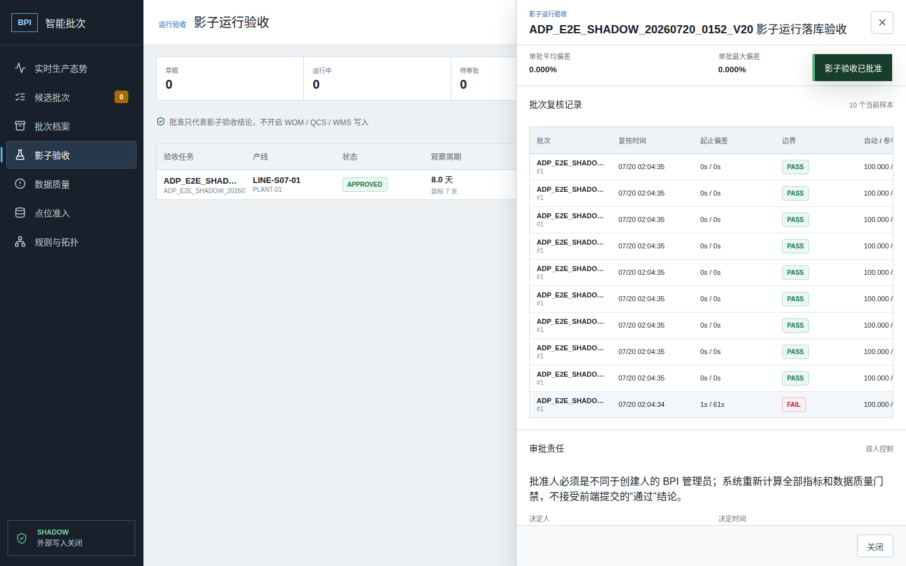

### 8.5 数据质量

**目标：** 按业务影响处置数据问题，而不是只看原始报警数量。

**主要内容：**

- required 信号不可用、时钟漂移、单位异常、序列缺口、坏点和重复点。
- 影响产线、规则、候选和批次。
- 服务端 snapshot-cutoff cursor 分页。
- 详情保留原始事件、生命周期、责任人和推荐动作。
- `OPEN -> ACKNOWLEDGED -> RESOLVED`，解决不删除原始事实。

**API：**

- `GET /bpi-api/data-quality/summary`
- `GET /bpi-api/data-quality/incidents`
- `GET /bpi-api/data-quality/incidents/{incidentId}`
- `POST /bpi-api/data-quality/incidents/{incidentId}/acknowledge`
- `POST /bpi-api/data-quality/incidents/{incidentId}/resolve`

**主要落表：**

- `bpi.bpi_data_quality_incidents`
- `bpi.bpi_data_quality_incident_events`
- `bpi.bpi_data_quality_incident_actions`
- `bpi.bpi_audit_events`

已解决事件只有在新事件时间晚于解决时间时才重新打开；迟到旧事件只保留事实，不倒退状态。

### 8.6 点位目录

**目标：** 在拓扑和规则使用测点前，证明设备身份、属性、单位、校准和来源序列可信。

**主要内容：**

- 当前不可变目录快照、来源 revision、checksum、READY/BLOCKED 数。
- product/device/property、原属性、规范属性、单位、设备激活/注册状态。
- 来源校准声明与 MES 权威校准分栏。
- 计量工程师提交证书 URI、SHA-256、版本和有效期。
- 非提交人管理员批准、驳回或撤销。
- HMAC scope-bound cursor、防篡改分页和服务端搜索。

**API：**

- `GET /bpi-api/point-catalog/current`
- `POST /bpi-api/point-catalog/snapshots`
- `GET|POST /bpi-api/point-calibrations`
- `POST /bpi-api/point-calibrations/{calibrationId}/approve`
- `POST /bpi-api/point-calibrations/{calibrationId}/reject`
- `POST /bpi-api/point-calibrations/{calibrationId}/revoke`

**主要落表：**

- `bpi.bpi_point_catalog_snapshots`
- `bpi.bpi_point_catalog_entries`
- `bpi.bpi_point_calibrations`
- `bpi.bpi_source_sequence_evidence_current`
- `bpi.bpi_audit_events`

**READY 必要条件：**

```text
设备 ACTIVE
+ 已注册
+ 属性存在
+ 单位一致
+ MES 校准 APPROVED 且在有效期
+ DEVICE/GATEWAY 来源 epoch/sequence 合格
+ product/device/property 与拓扑精确匹配
= READY
```

任何一项缺失都必须显示具体 blocker。来源系统自报 `VERIFIED` 不能替代 MES 四眼校准。

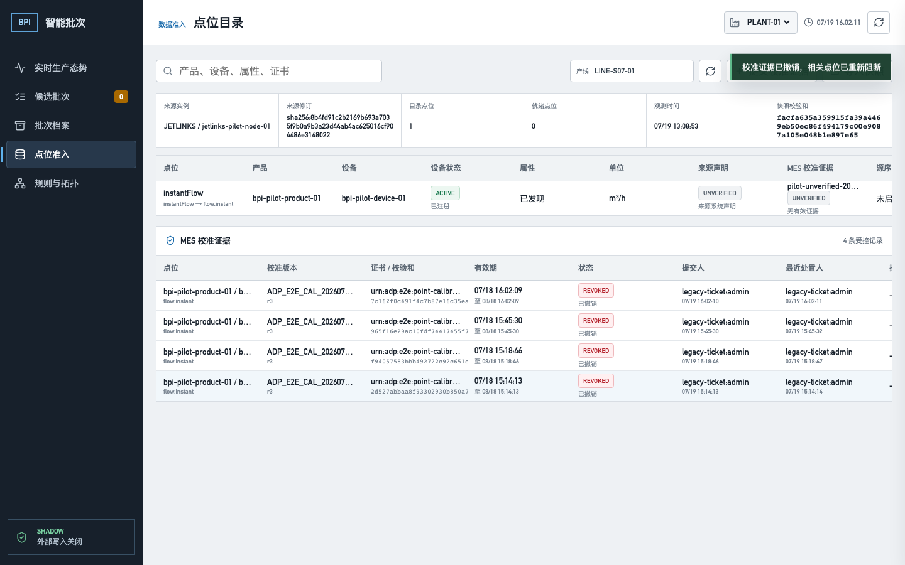

### 8.7 规则与拓扑

**目标：** 版本化维护工艺路径和多信号批次边界规则，并通过回放、双人审批和流处理回执上线。

**拓扑交互：**

- 新建或从已发布版本复制草稿。
- 编辑受控 topology JSON，绑定 product/device/property、逻辑信号、单位和校准版本。
- 校验悬空路径、有向环、共享 meter、必需信号和点位准入。
- 非创建人管理员发布；发布后不可修改。

**规则交互：**

- 创建规则 AST 草稿，只能引用已发布拓扑和已绑定信号。
- 选择时间窗口、校准版本和金标准集执行 PostgreSQL 历史回放。
- 只有 simulation `PASSED` 且 checksum 与草稿一致时才能提交审批。
- 创建人和提交人之外的管理员批准发布。
- 页面分开显示 Kafka publication、Flink application 和 runtime readiness。
- 已在线规则可受控退役；回滚通过复制历史版本创建新草稿。

**API：**

- `GET /bpi-api/topologies`
- `GET /bpi-api/topologies/{topologyId}`
- `GET /bpi-api/topologies/{topologyId}/compare`
- `POST /bpi-api/topologies/drafts`
- `POST /bpi-api/topologies/{topologyId}/validate`
- `POST /bpi-api/topologies/{topologyId}/publish`
- `GET /bpi-api/rules`
- `GET /bpi-api/rules/{ruleId}`
- `GET /bpi-api/rules/{ruleId}/compare`
- `POST /bpi-api/rules/drafts`
- `POST /bpi-api/rules/{ruleId}/simulate`
- `POST /bpi-api/rules/{ruleId}/submit-approval`
- `POST /bpi-api/rules/{ruleId}/publish`
- `POST /bpi-api/rules/{ruleId}/reject-approval`
- `POST /bpi-api/rules/{ruleId}/publication/retry`
- `POST /bpi-api/rules/{ruleId}/retire`

**主要落表：**

- `bpi.bpi_topology_versions`
- `bpi.bpi_rule_versions`
- `bpi.bpi_rule_golden_boundaries`
- `bpi.bpi_rule_simulations`
- `bpi.bpi_rule_approval_requests`
- `bpi.bpi_outbox_events`
- `bpi.bpi_audit_events`

**三个不能混淆的状态：**

| 状态面 | 证明内容 | 不能推导 |
| --- | --- | --- |
| `publicationStatus=PUBLISHED` | outbox 已投递 Kafka | Flink 已应用 |
| `applicationStatus=APPLIED` | Flink 收到并应用精确版本 | 点位运行准入仍有效 |
| `runtimeReadinessStatus=READY` | 评估器在当前点位目录下已启用 | 规则已经生产批准 |

### 8.8 数据集清单

**目标：** 从批准影子批次生成可重现、无时间泄漏、精确版本锁定的训练候选数据，不提前训练模型。

**当前流水线：**

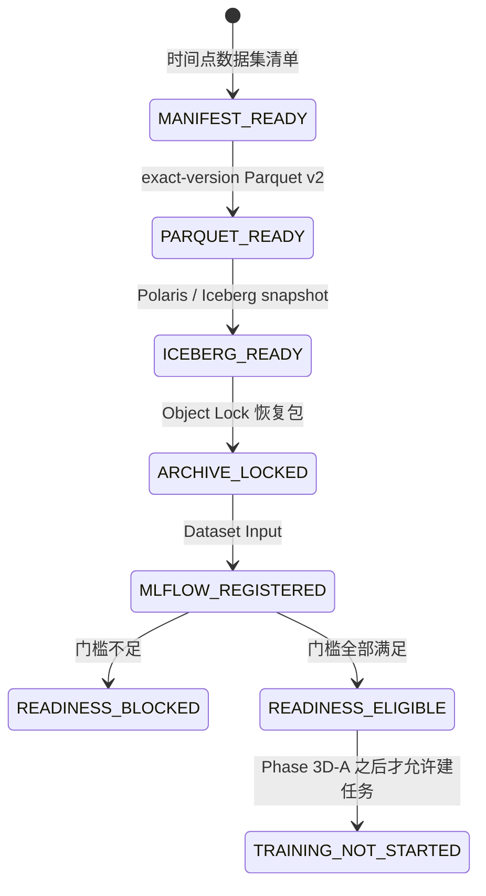

**定义交互：**

- 数据集编码、版本、工厂/产线、特征、标签、最大标签延迟和最低置信度。
- prediction time 固定为 `AUTOMATIC_BATCH_START`。
- feature cutoff 固定为 `AT_OR_BEFORE_PREDICTION_TIME`。
- 至少配置流量、泵态等两组 prediction-time 之前的工艺信号窗口。
- 每组窗口声明信号、值类型、聚合、偏移、最少样本、最大间隔、单位、校准和质量门槛。

**制品交互：**

- Manifest 显示纳入/排除样本和原因。
- Parquet 显示 exact `versionId`、SHA-256、行数、字节数和 schema。
- Iceberg 显示 table、snapshot ID、metadata location、schema/spec 和语义 checksum。
- Object Lock 显示保留模式、期限和恢复复验。
- MLflow 只登记 Dataset Input，不创建模型。
- Readiness 每次追加不可变 assessment/checksum，显示要求值、实际值和 blocker。

**API：**

- `GET /bpi-api/datasets`
- `POST /bpi-api/datasets`
- `POST /bpi-api/datasets/{datasetId}/snapshots`
- `GET /bpi-api/dataset-snapshots/{snapshotId}`
- `POST /bpi-api/dataset-snapshots/{snapshotId}/materializations`
- `GET /bpi-api/dataset-materializations/{materializationId}`
- `POST /bpi-api/dataset-materializations/{materializationId}/retry`
- `GET /bpi-api/dataset-materializations/{materializationId}/catalog-publications`
- `POST /bpi-api/dataset-materializations/{materializationId}/catalog-publications`
- `GET /bpi-api/dataset-catalog-publications/{publicationId}`
- `POST /bpi-api/dataset-catalog-publications/{publicationId}/retry`
- `GET /bpi-api/dataset-catalog-publications/{publicationId}/retention-archives`
- `POST /bpi-api/dataset-catalog-publications/{publicationId}/retention-archives`
- `GET /bpi-api/dataset-retention-archives/{archiveId}`
- `POST /bpi-api/dataset-retention-archives/{archiveId}/retry`
- `GET /bpi-api/dataset-retention-archives/{archiveId}/mlflow-registrations`
- `POST /bpi-api/dataset-retention-archives/{archiveId}/mlflow-registrations`
- `GET /bpi-api/dataset-mlflow-registrations/{registrationId}`
- `POST /bpi-api/dataset-mlflow-registrations/{registrationId}/retry`
- `GET /bpi-api/dataset-mlflow-registrations/{registrationId}/training-readiness-assessments`
- `POST /bpi-api/dataset-mlflow-registrations/{registrationId}/training-readiness-assessments`

完整 endpoint 和 operationId 见 [`docs/api/bpi-api-catalog.md`](../api/bpi-api-catalog.md)。

**主要落表：**

- `bpi.bpi_dataset_definitions`
- `bpi.bpi_dataset_snapshots`
- `bpi.bpi_dataset_snapshot_samples`
- `bpi.bpi_dataset_process_signal_window_facts`
- `bpi.bpi_dataset_materializations`
- `bpi.bpi_dataset_catalog_publications`
- `bpi.bpi_dataset_retention_archives`
- `bpi.bpi_dataset_mlflow_registrations`
- `bpi.bpi_dataset_training_readiness_assessments`
- `bpi.bpi_api_idempotency`
- `bpi.bpi_audit_events`

**当前事实：** Phase 3C-G 已证明 `process.window.flow_instant.mean_60s=20.000000`
和 `process.window.pump_running.true_ratio_30s=0.500000` 可进入 Parquet v2 和指定 Iceberg snapshot。
这不代表数据达到训练资格。

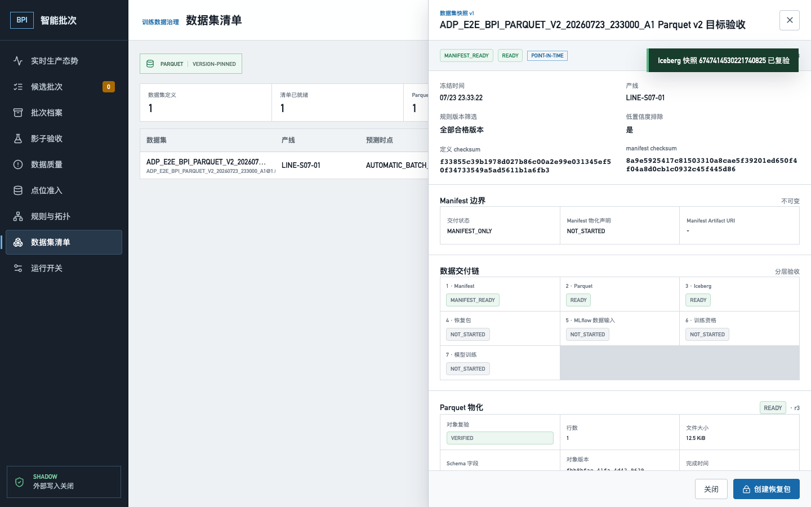

### 8.9 运行开关

**目标：** 按 tenant、plant、line 分层控制页面、命令和集成，不通过改配置文件临时开生产功能。

**主要内容：**

- 当前有效值、来源层级、当前编辑层覆盖、执行状态和最近变更。
- 解析目标与编辑层分离。
- `SET true/false` 创建当前层覆盖。
- `INHERIT` 停用当前层覆盖，恢复上级解析。
- 变更原因不少于 8 个字符。

**主要开关：**

| Key | 当前治理含义 |
| --- | --- |
| `bpi.ui` | 是否向旧 MES 菜单注入 BPI |
| `bpi.commands` | 是否允许 BPI 业务命令 |
| `bpi.rule-management` | 是否允许规则治理命令 |
| `bpi.shadow-only` | Phase 1 影子边界，受阶段锁定 |
| `bpi.auto-confirm` | 自动确认，当前锁定关闭 |
| `bpi.wms-link` | WMS 联动，生产准入前默认关闭 |

**API：**

- `GET /bpi-api/feature-flags`
- `POST /bpi-api/feature-flags/{flagKey}`

**主要落表：**

- `bpi.bpi_feature_flags`
- `bpi.bpi_api_idempotency`
- `bpi.bpi_audit_events`

adapter 不可用时 Nginx 回退原 ADP 菜单；固定 `#/featureFlags` 深链接用于管理员恢复，避免菜单自锁。


## 9. 核心端到端流程

### 9.1 数采到影子批次

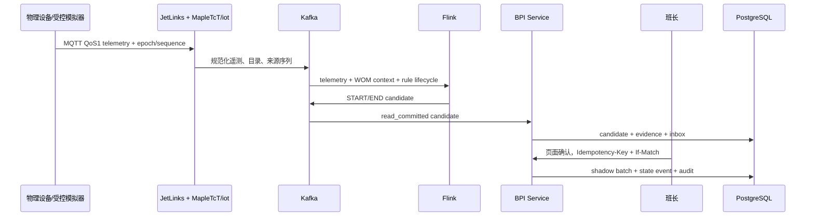

### 9.2 质量放行到完工入库

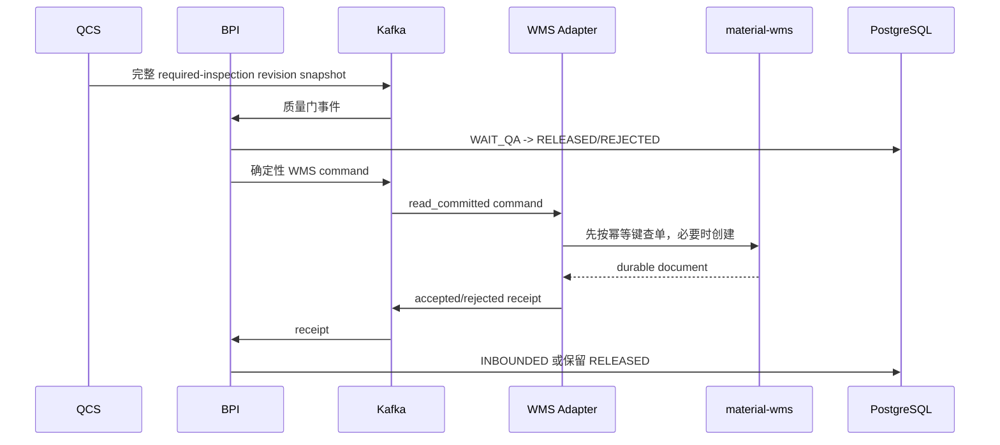

只有非影子批次、QCS/WMS 两个开关、作用域和外部回执均满足时才允许进入持久入库。

### 9.3 数据集到训练门槛

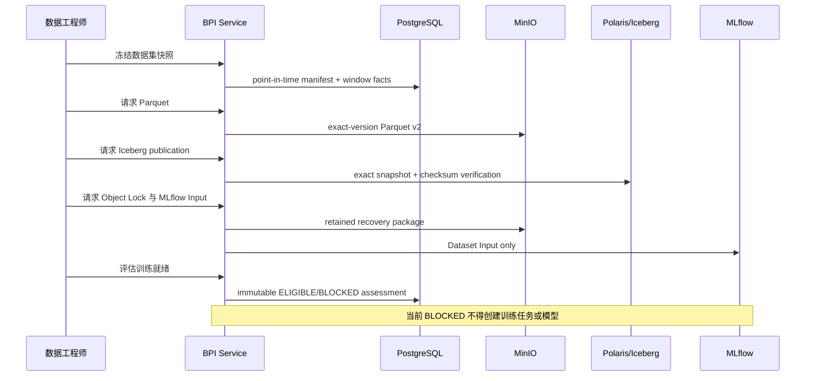

## 10. 当前完成度与明确缺口

项目目标账本当前为：

| 指标 | 数量 |
| --- | ---: |
| 总目标 | 21 |
| READY | 9 |
| PARTIAL | 11 |
| BLOCKED | 1 |

当前可以确认：

- ADP 基础登录、组织、权限、菜单和待办主流程可用。
- BPI 九个前端页面均已有真实目标环境验证。
- MQTT/JetLinks/Kafka/Flink/PostgreSQL 到 START/END 影子批次的软件链已闭合。
- QCS 到内部 material-wms 蓝单/红单的软件链已闭合。
- 数据集治理已到 Parquet v2、Iceberg、Object Lock、MLflow Dataset Input 和失败关闭 readiness。

仍不能确认：

- 物理 DEVICE/GATEWAY 来源、断电重连和正式计量证书。
- 至少 200 个不同真实复核批次、7 个生产日和真实类别平衡。
- 至少 100 个 accepted START 和 10 个 rejected START 标签。
- 选定产线连续 7-14 天真实影子运行。
- 多点、多产线、高吞吐容量和故障恢复。
- 外部 ERP/WMS 正式实例。
- MLflow 生产 RBAC、SSO、TLS、HA。
- 整站备份恢复、RPO/RTO、生产域名/TLS、安全加固和正式签字。
- 模型训练、登记、审批、推理和生产激活。

因此，当前产品可定义为“工程化集成测试系统”，不能定义为“生产 READY”。

## 11. 功能验收标准

任何可改变业务数据的交互都必须同时具备：

1. 真实页面操作和唯一 marker。
2. HTTP method、URL、payload、status 和关键 response。
3. controller/service/repository 或 adapter/consumer 链路。
4. PostgreSQL 目标表和精确查询结果。
5. 更新、状态变更或删除后的字段复验。
6. 浏览器 console、page、request error 统计。
7. 幂等重放、revision 冲突和权限反证。
8. marker 定向清理和清理后查询。
9. 组件、开关、镜像和 allowlist 恢复。
10. 不把模拟、HTTP 200 或临时 sidecar 当作生产结论。

训练相关命令还必须证明：

- 当前 readiness 为 `BLOCKED` 时返回受阻结论。
- 不创建训练任务。
- 不创建 MLflow model、model version 或 online endpoint。
- 不改变 inference/activation 开关。

## 12. 关联文档

| 文档 | 用途 |
| --- | --- |
| [`README.md`](../../README.md) | 仓库接手入口、当前完成度和常用命令 |
| [`docs/designs/batch-process-intelligence.md`](../designs/batch-process-intelligence.md) | BPI 技术总设计 |
| [`docs/designs/bpi-interaction-design.md`](../designs/bpi-interaction-design.md) | 早期交互基线与详细异常约定 |
| [`docs/api/bpi-api-catalog.md`](../api/bpi-api-catalog.md) | API operationId、状态和实现等级 |
| [`contracts/bpi-api/openapi.json`](../../contracts/bpi-api/openapi.json) | 同步 API 权威机器合约 |
| [`contracts/bpi-api/asyncapi.json`](../../contracts/bpi-api/asyncapi.json) | Kafka 事件权威机器合约 |
| [`docs/project-goal-acceptance.md`](../project-goal-acceptance.md) | 项目目标总账 |
| [`docs/goal-gap-register.md`](../goal-gap-register.md) | 未完成缺口总账 |
| [`docs/current-content-inventory.md`](../current-content-inventory.md) | 源码、模块和 Docker 服务库存 |
| [`docs/testing/bpi-dataset-parquet-v2-process-window-acceptance.md`](../testing/bpi-dataset-parquet-v2-process-window-acceptance.md) | Phase 3C-G 最新目标验收 |

## 13. 下一产品切片

下一阶段是 Phase 3D-A 训练任务控制面，而不是直接训练模型：

1. 只能从不可变、`ELIGIBLE` 的 readiness assessment 创建训练任务。
2. 当前目标数据不足时必须返回 `422`，且任务表和 MLflow 模型表保持零变化。
3. 训练任务必须有 tenant/plant/line scope、幂等键、revision、审计和职责分离。
4. 浏览器不能提交存储地址、MLflow 地址、模型注册表地址或生产 endpoint。
5. 在物理来源、正式校准、200 批、7 天和 7-14 天现场证据关闭前，不开放正向训练。
