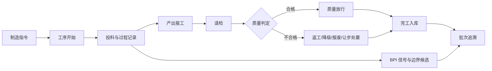

# FT MES 精简标准版产品说明书

> 文档状态：`PRODUCT_BASELINE_PROPOSAL`
>
> 生成日期：2026-08-10
>
> 代码基线：`c1233a3c2319ed8ff26c974c9f297d50cb673744`
>
> 证据口径：本轮为本地源码、菜单、服务、数据库映射和历史验收资产审计。未重新连接测试环境，
> 因此本文中的 `PASS` 表示已有可复验证据，不表示 2026-08-09 当天完成了新的现场复验。

## 1. 产品结论

FT MES 不应继续发展成覆盖生产、设备、能源、安环、实验室、资质、低代码开发和系统运维的
大而全套件。标准产品应聚焦流程制造企业最短、最重要的生产事实闭环：

```text
制造指令 -> 工序执行 -> 投料/退料/报工 -> 请检 -> 质量处置
        -> 完工入库 -> 批次追溯 -> 工艺数据复盘
```

精简标准版的产品承诺是：

1. 一张制造指令能够被真实执行，而不是只保存一张表单。
2. 每次投入、产出、检验、放行和库存变化都能回到同一批次。
3. 每个写动作都有 API、业务状态、PostgreSQL 事实和审计证据。
4. 连续生产场景可由 BPI 读取真实信号并提出批次边界候选，但默认不替代人工确认。
5. 行业差异通过行业能力包、配置和版本清单叠加，不污染标准核心。

标准产品明确不承担财务、采购、销售、人力、通用 OA、完整 EAM、完整 LIMS、完整 EHS 或
通用低代码平台的产品责任。上述能力可以作为独立行业包存在，但不得因为源码已经恢复就默认启用。

## 2. 目标客户和适用边界

### 2.1 首要客户

首个标准版面向具有以下特点的流程制造企业：

- 一条或多条连续、半连续生产线。
- 生产按制造指令、工序批、罐批或物料批组织。
- 需要记录流量、重量、液位、温度、压力、pH、浓度、波美值等工艺参数。
- 质量检验直接影响批次放行、库存可用和下工序使用。
- 需要从成品反查原料、工序、质量和库存，也需要从原料正向追踪影响范围。
- 现场已有 PLC、DCS、仪表或 IoT 平台，但 MES 不直接控制设备。

果糖、淀粉糖、生物发酵、食品配料和精细化工属于优先场景。离散装配、完整制药 LIMS、
重资产设备检维修和全厂能源管理应先作为独立能力包建设。

### 2.2 非目标

- 不把所有恢复模块都修到可用后才发布标准版。
- 不把 HTTP 200、菜单可见或表存在当成功能完成。
- 不把低代码实体配置页面直接当成最终业务产品页面。
- 不在标准版中默认运行 MLflow、Polaris、Iceberg、Object Lock 等训练数据链。
- 不让 MES 向 PLC/DCS 发送控制命令。
- 不为单个客户永久复制一套核心代码。
- 不重新把 Oracle 变成默认运行数据库。

## 3. 产品组合

本说明书描述 `MES Standard` 组合的核心业务体验，不代表所有领域产品必须绑定部署。产品依赖、成熟度、
独立发布边界和行业组合以
[FT 制造软件模块化产品矩阵](ft-mes-modular-product-portfolio.md) 为准。

| 商业组合 | 默认产品 | 定位 |
| --- | --- | --- |
| `MES Start` | 两层共享底座、MES Execute、Trace 基础视图 | 最轻生产执行与追溯起步包 |
| `MES Standard` | `MES Start` 加 QMS Core、WMS Production、Trace 完整视图 | 生产、质量、库存闭环主线 |
| `Process Intelligence` | `MES Standard` 加 FT BPI | 连续/半连续流程制造和信号批次 |
| `Quality & Lab` | 两层底座、QMS Core、FT Lab、Trace | 独立质量与实验室中心，Lab 达到门禁后发布 |
| `Asset Reliability` | 两层底座、Reliability Patrol | 巡检、异常和设备可靠性独立产品 |
| `EHS Operations` | 两层底座、EHS、共享巡检 | 作业许可、JSA 和安环巡检 |
| `Energy Optimization` | 两层底座、Energy；可选 BPI/Trace | 当前依赖阻断，不发布 |

食品、生物、化工、离散等差异通过组合清单、模板和适配器叠加，不再复制整套核心代码。

## 4. 用户角色

| 角色 | 核心任务 | 标准版入口 | 关键限制 |
| --- | --- | --- | --- |
| 生产调度 | 下达、调整和关闭制造指令 | 工作台、制造指令 | 不能修改已生效质量结果 |
| 班长 | 开始/暂停/恢复工序，处理现场异常 | 执行工作台 | 不能发布 BPI 规则 |
| 操作员 | 投料、退料、报工、记录工艺活动 | 执行工作台、物料执行 | 只能操作授权产线和班次 |
| 工艺工程师 | 维护配方、工艺路线、参数窗口和批次规则 | 主数据、智能批次治理 | 不能批准自己提交的规则 |
| 质量人员 | 请检、录入结果、判定、处置和放行 | 质量工作台 | 不能修改生产数量事实 |
| 仓储人员 | 完工入库、领料、退库、冻结和放行核对 | 物料库存 | 不能绕过质量门禁 |
| 追溯/审计人员 | 查询批次谱系、操作日志和证据 | 批次追溯、审计 | 默认只读 |
| 系统管理员 | 用户、组织、角色、字典、运行开关 | 系统管理 | 技术配置不向业务用户开放 |
| BPI 管理员 | 点位准入、独立审批、运行开关和故障恢复 | 智能批次治理 | 不能绕过状态机和职责分离 |

## 5. 核心业务对象

| 对象 | 业务含义 | 关键关系 |
| --- | --- | --- |
| 工厂/车间/产线/工作单元 | 生产组织和执行边界 | 产线属于车间，工作单元承载工序 |
| 物料/产品 | 可投入、产出、检验和结算的对象 | 使用统一单位和批次策略 |
| 中间品 | 需要独立数量、质量、库存或谱系结算的工序产物 | 连接上下游工序批 |
| 配方/BOM | 目标产品的投入结构和版本 | 关联工艺路线和质量标准 |
| 工艺路线/工序/活动 | 如何生产以及在哪执行 | 活动属于工序，工序属于路线 |
| 制造指令 | 一次受控生产任务 | 关联产品、配方、产线、计划数量和批号 |
| 工序执行 | 制造指令中一道工序的实际执行实例 | 记录实际起止、状态、人员和工作单元 |
| 物料批次 | 原料、中间品或成品的可追溯身份 | 关联投入、产出、质量和库存事务 |
| 检验申请/报告 | 对物料批次的质量要求和结果 | 决定批次合格、冻结、放行或处置 |
| 库存单据/事务 | 数量变化的业务凭证和不可变流水 | 更新批次库存，但不得覆盖历史事务 |
| 批次谱系边 | 投入批次到产出批次的转换关系 | 用于正向和反向追溯 |
| BPI 候选/影子批次 | 由生产上下文和信号推断的边界事实 | 人工确认后关联 MES 制造与工序上下文 |

### 5.1 中间品定义规则

满足以下任一条件时，应把工序产物定义为中间品：

- 进入缓冲罐、储罐或中间仓，可以暂停等待。
- 有独立流量、重量、液位等数量结算。
- 需要独立请检、放行或质量判定。
- 下一工序可能跨班组、产线、订单或时间段使用。
- 可能分批、合批、回配、返工或报废。
- 需要成为物料平衡、成本或批次谱系节点。

泵送、换热、闪蒸、保温等不改变独立物料身份的设备活动，只记录为工序活动和工艺参数。

## 6. 标准业务主流程



### 6.1 制造指令

输入：产品、版本化配方、工艺路线、计划数量、计划时间、生产批号、目标产线和质量标准。

核心动作：新建、保存草稿、下达、开始、暂停、恢复、提前放料、结束、取消和查看详情。

核心状态：`草稿 -> 待执行 -> 执行中 <-> 保持 -> 已完成/已取消`。

验收要求：指令、工序、活动、投入、质量要求和待办必须在同一事务边界或可补偿链中形成，
重复请求不得创建第二张指令。

### 6.2 工序与活动执行

工序记录实际开始、实际结束、工作单元、人员、班次和状态。活动用于记录投料、产出、检查、
设备动作和人工确认。标准版不再把“工序执行记录、指令执行记录、活动执行记录、投料记录、
产出记录”做成彼此孤立的顶级菜单，而是在统一执行详情中以页签和时间线呈现。

### 6.3 投料、退料和报工

投入必须记录物料、批次、数量、单位、来源库位、操作人、时间和关联工序。退料必须引用原投入事实，
不能只生成一张无来源的负数单。产出报工生成或确认产出批次，并形成投入到产出的谱系边。

标准版将原 WOM 的备料、配料、退料、用料、报工和尾料页面收敛为三个工作区：

| 工作区 | 包含动作 |
| --- | --- |
| 物料准备 | 备料需求、配料需求、待领料 |
| 现场物料 | 投料、补料、退料、尾料、批次切换 |
| 报工与产出 | 产出数量、不良数量、工序报工、完工报工 |

### 6.4 质量闭环

质量工作台统一承载来料、过程、成品和其他检验。检验类型是业务属性，不再为每种类型复制整套菜单。

核心状态：

```text
待请检 -> 待受理 -> 检验中 -> 报告待生效 -> 合格/不合格
                                     -> 处置中 -> 已结案
                                     -> 紧急/让步放行
```

标准版必须支持：

- 由制造指令、工序或人工入口创建检验申请。
- 从质量标准带出必检项目、单位、上下限和判定规则。
- 保存原始结果、复核结果、最终判定和操作者。
- 合格后释放库存；不合格时冻结批次并阻止领用。
- 处置结果回写批次和库存，但保留原始不合格事实。
- 同一报告重放不重复放行或重复入库。

完整的 24 页面样品生命周期、稳定性试验、留样和实验室仪器集成不进入 `standard-core`。

### 6.5 完工入库与库存

完工入库以产出批次为对象，保存单据头、明细、库存事务和批次库存。质量未决批次进入待检或冻结，
只有满足质量门禁后才成为可用库存。库存数量由事务汇总得到，不允许直接改最终余额冒充业务动作。

标准版库存动作：完工入库、生产领料、生产退料、质量冻结、质量放行、入库冲销和批次库存查询。
库位策略、波次、运输、自动化立库和外部 ERP/WMS 补偿属于后续仓储能力包或集成项目。

### 6.6 批次追溯

批次追溯至少显示：

- 制造指令、产品、配方和生产线。
- 原料批、中间品批、成品批及数量转换。
- 工序实际起止、活动、人员和工作单元。
- 检验申请、报告、判定、处置和放行。
- 入库、领料、退料、冲销和当前库存。
- BPI 边界候选、关键工艺窗口和数据质量事件。

追溯查询必须支持成品向原料反查和原料向影响批次正查。列表双击、详情按钮和深链接都应进入同一只读详情，
不能出现“表格有数据但无法打开”的情况。

## 7. 智能批次与工艺数据

### 7.1 标准版 BPI 范围

`standard-bpi` 默认保留六个用户任务，不把九个技术页面全部暴露为顶级菜单：

| 用户任务 | 页面形态 | 说明 |
| --- | --- | --- |
| 看实时状态 | 实时态势 | 当前生产上下文、关键点位和最近异常 |
| 处理批次候选 | 候选批次 | 确认、拒绝或补充 START/END 边界 |
| 查批次事实 | 批次档案 | 边界、证据、质量、库存和时间线 |
| 处理数据问题 | 数据质量 | 缺数、乱序、漂移、单位和来源问题 |
| 管理点位与规则 | 治理页签 | 点位、校准、拓扑、规则和审批 |
| 管理运行开关 | 管理员页签 | 产线级启停和失败恢复 |

数据集、Parquet、Iceberg、Object Lock、MLflow 和训练准备度保留为研发/数据工程 profile，
默认不运行，也不出现在标准生产用户菜单。

### 7.2 批次边界

开始边界至少由两个以上信号共同确认，例如：制造指令已开始、阀门路径成立、泵运行、
流量超过阈值并持续、目标罐液位上升。结束边界可由流量低于阈值、泵停止、阀门切换、
累计量完成、接收罐切换或生产上下文切换共同判断。

BPI 采用事件驱动流处理，不使用“每条产线一个定时线程不停扫数据库”的实现。MQTT/JetLinks 事件进入
Kafka，Flink 按事件时间、规则版本和状态机计算候选，PostgreSQL 保存候选、证据、状态和审计。

### 7.3 自动化边界

影子模式只提出候选，不直接创建请检、入库或质量结论。只有点位身份、校准、来源序列、生产上下文、
数据质量、人工认同率和累计量偏差全部达到门槛后，才能单独启用质量/WMS 联动。

## 8. 目标信息架构

标准版只保留八个一级入口：

| 一级入口 | 二级页面 | 主要用户 |
| --- | --- | --- |
| 工作台 | 我的任务、生产异常、待检、待处置、待入库 | 全员 |
| 生产执行 | 制造指令、执行工作台、物料执行、报工与产出 | 调度、班长、操作员 |
| 质量管理 | 检验申请、检验报告、不合格处置、质量放行 | 质量人员 |
| 物料库存 | 库存台账、入出库单据、批次库存、库存事务 | 仓储人员 |
| 批次追溯 | 批次谱系、工序履历、质量与库存时间线 | 生产、质量、审计 |
| 智能批次 | 实时态势、候选、批次、数据质量、治理 | BPI 相关角色 |
| 主数据 | 工厂模型、物料、配方/BOM、工艺路线、质量标准、班组班次 | 主数据管理员 |
| 系统管理 | 组织用户、角色权限、字典、审计、集成与运行开关 | 系统管理员 |

低代码实体、模型、视图、菜单、脚本、工作流设计器、Redis 配置、接口开关、微服务配置和运维工具
进入“实施控制台”，默认不授予业务角色，也不计入标准产品菜单数量。

## 9. 页面交互规则

1. 每个列表必须明确主动作，查询页不强塞无意义的新增和删除。
2. 双击、查看详情和单据编号链接必须进入同一详情。
3. 详情页展示业务状态、可执行动作和不可执行原因，不留无解释空白区域。
4. 无数据时显示业务空态；加载失败时显示 traceId 和失败区域，不显示 Java 异常堆栈。
5. 相近菜单优先用页签、分段控件或筛选器合并，不复制完整页面。
6. 破坏性动作必须二次确认，并说明影响对象和数量。
7. 保存成功后展示业务编号和终态；接口 200 但业务失败不得提示成功。
8. 表格列不得直接显示 `ec.common.tableNo`、`Button.text.*` 等资源键。
9. 权限既控制按钮可见，也由后端在命令执行时再次校验。
10. 所有写命令支持幂等键；状态更新支持 revision 或等价乐观锁。

## 10. 数据所有权和集成边界

| 数据域 | 权威系统 | FT MES 职责 | 外部集成 |
| --- | --- | --- | --- |
| 人员组织和角色 | FT MES/企业 IAM | 执行权限和审计作用域 | 可同步企业统一身份 |
| 物料、产品、供应商 | 由项目确定，通常 ERP/主数据平台 | 保存生产执行快照和本地扩展 | 版本化主数据接口 |
| 配方、工艺、质量标准 | FT MES 或受控工艺/质量系统 | 版本、审批、生效和生产引用 | DCS/Batch 投递需独立回执 |
| 制造指令和执行事实 | FT MES | 权威状态和执行记录 | 接收 ERP 计划，返回进度和产量 |
| 检验和质量判定 | QCS/FT MES | 申请、报告、处置和放行 | 可对接外部 LIMS |
| 库存余额和事务 | 内部 material-wms 或外部 WMS/ERP | 内部版可权威；外部版保存幂等回执 | query-first、outbox 和补偿 |
| 原始遥测 | JetLinks/IoT | 消费、治理和关联，不覆盖原始来源 | MQTT/Kafka 版本化事件 |
| 批次推断事实 | BPI | 候选、证据、影子批次和人工确认 | 通过受控命令联动 MES/QCS/WMS |

## 11. 权限、审计和合规

- 权限作用域至少包含租户、公司、工厂、产线、角色和业务动作。
- 规则发布、校准批准、强制结束、质量放行和入库冲销采用职责分离。
- 审计记录操作者、时间、对象、前后版本、原因、请求幂等键和 traceId。
- 电子签名不进入所有动作，只在法规或客户配置要求的受控动作启用。
- 文件保存对象版本、哈希、业务引用和下载权限，不把共享目录路径当业务证据。
- 软件狗授权逻辑不得影响测试和开发，但生产许可策略必须在发布门禁中明确。

## 12. 技术产品形态

### 12.1 当前兼容运行面

当前仓库包含 80 个 Compose 服务，其中 28 个平台运行服务、20 个业务运行服务、21 个支持运行服务和
11 个基础设施服务。平台主体仍是 Java 8、Spring Boot 2.1.5 和恢复 JAR；BPI 使用 Java 17、Spring Boot 3.4.7。

这些数字反映恢复历史，不是目标产品架构。菜单裁剪可以先做，服务删除必须在调用链和运行观测完成后进行。

### 12.2 目标部署单元

标准版目标收敛到 10 至 14 个应用部署单元、18 至 25 个总容器：

| 目标部署单元 | 合并来源或职责 |
| --- | --- |
| `edge-gateway` | Nginx、统一入口、路由和基础限流 |
| `identity-access` | IAM、组织、用户和 RBAC |
| `platform-core` | 字典、配置、流程、待办、国际化、任务和审计 |
| `mes-master-data` | 工厂、物料、配方、工艺和质量标准 |
| `mes-production` | WOM 及生产入口、打印和质量上报伴随模块 |
| `mes-quality` | QCS 核心请检、报告、处置和放行 |
| `mes-inventory-trace` | material-wms、库存事务和 ProcessAnalysis |
| `file-document` | 文件、附件、受控对象存储 |
| `notification-worker` | 站内信和按需启用的外部渠道 |
| `integration-hub` | ERP/WMS/LIMS/DCS 适配、outbox 和回执 |
| `bpi-control` | BPI API、治理、候选和批次事实 |
| `bpi-stream` | Kafka/Flink 事件处理，仅 BPI 版本启用 |

行业包可以增加部署单元，但标准核心不为每个旧模块保留一个常驻微服务。

### 12.3 技术升级原则

- PostgreSQL 保持默认数据库，迁移只允许 expand/contract 和可回滚变更。
- Java 21 升级按部署单元分阶段完成，不对 60GB 历史包做一次性重编译切换。
- 先建立 API/事件契约和黑盒回归，再替换旧 JAR 或合并服务。
- 前端逐步以稳定业务 API 替代运行时视图补丁，但短期保留兼容层。
- 文件服务拆分元数据和对象内容，支持分片、流式传输、校验、版本和生命周期策略。
- ML/数据湖组件保持 profile 化和默认关闭，不成为 MES 核心启动依赖。

## 13. 当前证据和缺口

| 范围 | 历史证据 | 当前产品判断 |
| --- | --- | --- |
| 登录、组织、RBAC、菜单、待办 | 真实页面和 PostgreSQL marker 已通过 | 进入标准版 |
| 制造指令到批次追溯 | 2026-07-27/28 完整链通过 | 进入标准版并持续回归 |
| 合格/不合格库存门禁 | 两分支均有落库证据 | 进入标准版，补处置结案 |
| RM 配方 | 9 个入口和部分 CRUD 通过 | 合并为配方中心，不保留 9 个平铺入口 |
| QCS | 核心申请、报告、处置和放行通过 | 合并为统一质量工作台 |
| 完整 LIMS 样品链 | 页面较多，部分只有导航证据 | 进入实验室行业包 |
| PATROL | 配置、任务、结果、异常移交通过 | 进入设备/安环共享能力包 |
| WTS | 动火全链通过，部分作业只有页面证据 | 进入 EHS 包，不进入标准版 |
| EAM/维护/备件/计量/工具 | 169 个空白页集中在旧包 | 默认隐藏，取得完整前端和落库证据后再启用 |
| EMS | 缺 Indicator 依赖和 PostgreSQL 初始化 | 不发布 |
| BPI 影子批次 | 受控 MQTT/WOM 链通过 | `standard-bpi` 可用，现场准入未完成 |
| BPI 自动生产批次 | 业务上下文曾出现物料/数量为空 | 不能宣称生产就绪 |
| 通知送达 | WTS 同轮站内信/移动通知失败 | 标准版只保留可靠站内任务，外部渠道默认关闭 |
| 生产迁移 | 总闸门仍为 BLOCKED | 不能用测试证据替代生产切换签字 |

## 14. 标准版发布门槛

每个标准版功能必须满足：

1. 真实业务用户能从菜单进入，不依赖运维人员拼 URL。
2. 列表、详情、查询、写动作和空态均无 console、network 或可见系统错误。
3. 写动作使用唯一 marker，并保存 method、URL、payload、response 和 traceId。
4. Controller、Service、DAO/Mapper、SQL 和目标表链路可追踪。
5. PostgreSQL 直接查询证明新增、更新、删除或状态变化真实发生。
6. 幂等重放不增加第二份业务事实。
7. 权限不足、质量不合格、库存不足和依赖中断等反向路径可预期失败。
8. 服务重启后状态可恢复，数据库和对象存储可备份恢复。
9. 升级和回滚演练通过，且没有把 Oracle 恢复成默认路径。
10. 由生产、质量、仓储和 IT 责任人分别签字。

## 15. 标准版验收场景

首个冻结版本至少保留六个可重复场景：

| 场景 | 关键验证 |
| --- | --- |
| 正常制造闭环 | 指令、投料、报工、合格、入库、追溯 |
| 不合格闭环 | 不合格、冻结、领料阻断、处置和结案 |
| 退料/冲销 | 引用原单、负向事务、净库存和审计 |
| 服务中断恢复 | 超时重放、幂等、重启恢复和无重复单据 |
| 果糖两工序 | 淀粉浆、液化液、糖化液、波美值/流量和工序交接 |
| BPI 影子批次 | 真实生产上下文、五信号、START/END、人工确认和零未授权写回 |

## 16. 产品路线

### 第一阶段：标准版收敛

冻结八个一级入口，隐藏未进入标准版的菜单，建立版本能力清单和标准回归场景。此阶段不删除旧表和 JAR。

### 第二阶段：核心体验和数据闭环

把 WOM 分散记录、QCS 多套检验菜单、RM 多种配方入口和 BPI 多个技术页合并为任务型工作台，
补齐异常、结案、幂等和重启恢复。

### 第三阶段：部署单元收敛

按调用证据合并平台服务、通知服务和生产伴随服务，减少常驻容器和重复配置。每次只迁移一个边界清晰的部署单元。

### 第四阶段：行业能力包

以同一标准核心叠加食品流程、设备可靠性、EHS、实验室合规和能源包。行业包必须有独立菜单清单、
数据库迁移、Compose profile、权限种子、验收场景和回滚方案。

## 17. 关联资产

- [模块化产品矩阵](ft-mes-modular-product-portfolio.md)
- [功能裁剪与行业分支策略](ft-mes-capability-rationalization.md)
- [当前项目地址与 BPI 交互说明](ft-mes-bpi-product-interaction-manual.md)
- [标准核心链路验收](../testing/standard-core-flow-acceptance-20260728.md)
- [admin 权限目录全量扫描](../admin-permission-functional-scan-20260730.md)
- [前端功能测试报告](../frontend-functional-test-report.md)
- [后端落库验收](../backend-table-audit/persistence-acceptance.md)
- [机器可读能力裁剪矩阵](../../metadata/product-capability-rationalization.json)
