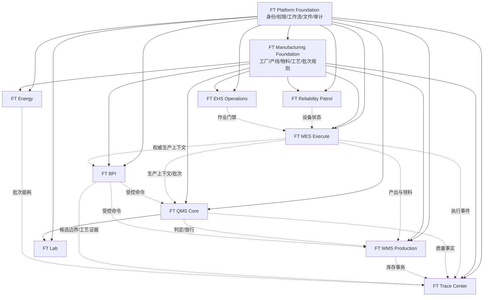

# FT 制造软件模块化产品矩阵

> 文档状态：`PRODUCT_PORTFOLIO_BASELINE_PROPOSAL`
>
> 生成日期：2026-08-10
>
> 代码基线：`c1233a3c2319ed8ff26c974c9f297d50cb673744`
>
> 证据口径：本矩阵基于本地源码、250 个 Maven 模块依赖、Compose 服务、菜单、数据库映射和历史验收资产。
> 本轮未连接测试服务器，因此“当前成熟度”表示已有证据上限，不等于新的现场生产验收。

## 1. 产品决策

FT 制造软件不再建设为一个必须整体部署、整体授权、整体升级的大而全 MES。目标形态是一个
**共享制造底座 + 可独立交付领域产品 + 可组合行业方案包**的产品族。

这意味着：

1. 组织、权限、审计、文件、字典、工作流等能力只建设一次，作为所有产品的共享底座。
2. MES、QMS、生产仓储、追溯、BPI、实验室、可靠性、EHS 和能源按业务边界独立验收。
3. 领域产品之间通过版本化业务契约集成，不以数据库跨库直连形成隐式依赖。
4. 商业套餐和行业方案只是产品组合清单，不产生永久行业代码分支。
5. 客户只部署需要的产品、数据库迁移、菜单、权限和服务，不为未购买能力承担运行成本。
6. 每个产品独立声明成熟度；不能用一个已通过的 MES 主流程替其他模块背书。

现有 45 项功能裁剪清单仍然有效，但它是**实现层输入**，不是产品层结构。产品层权威关系以本文和
[机器可读产品矩阵](../../metadata/product-portfolio-matrix.json) 为准。

## 2. 为什么不采用传统版本堆叠

### 2.1 被否决的方案

| 方案 | 优点 | 主要问题 | 结论 |
| --- | --- | --- | --- |
| 基础版 / 专业版 / 旗舰版逐级叠加 | 销售表述简单 | 高版本必然越来越重，模块内部依赖继续失控 | 否决 |
| 每个行业长期维护独立分支 | 客户差异短期落地快 | 公共修复无法同步，数据模型和升级路径持续漂移 | 否决 |
| 一个微服务对应一个菜单或 SKU | 看似边界清楚 | 运维单元爆炸，分布式事务和部署成本更高 | 否决 |
| 按领域产品组合 | 边界、责任和依赖可解释 | 需要先补契约、版本清单和独立验收 | 采用 |

### 2.2 设计原则

- **产品边界以业务事实和状态机划分**，不以历史 JAR、菜单目录或数据库表名前缀划分。
- **部署边界可以粗于产品边界**。小客户可把多个产品部署在同一应用和 PostgreSQL 集群中。
- **数据归属唯一**。生产事实归 MES，质量事实归 QMS，库存事务归 WMS，信号证据归 BPI。
- **集成失败可降级**。QMS 暂停不应阻止 MES 保存生产事实，但应关闭质量放行路径。
- **默认失败关闭**。缺少权威数据、校准或质量结论时，不自动放行、不自动入库、不自动生成正式批次。

## 3. 四种依赖关系

| 依赖类型 | 定义 | 对启动的影响 | 示例 |
| --- | --- | --- | --- |
| 硬依赖 `HARD` | 产品自身无法建立身份、主数据或事务边界 | 缺失时产品不能启用 | MES 依赖平台底座和制造主数据 |
| 集成依赖 `INTEGRATION` | 缺失时产品仍能独立运行，但跨域闭环减少 | 降级运行并明确提示 | QMS 不连接 WMS 时不能自动冻结库存 |
| 数据源依赖 `DATA_SOURCE` | 某项价值依赖权威外部或现场数据 | 对应功能 `ready=false` | BPI 依赖 IoT 遥测和生产上下文 |
| 组合关系 `BUNDLE` | 销售、实施和发布的产品清单 | 不新增代码依赖 | 食品流程方案组合 MES、QMS、WMS、BPI |

任何跨产品数据库查询都不能被登记为合法产品依赖。跨域写动作必须通过 API、事件和 inbox/outbox 完成，
并保存幂等键、来源版本和审计记录。

## 4. 产品依赖图



实线表示硬依赖，虚线表示可降级的集成关系。BPI 的目标架构依赖“权威生产上下文契约”，当前实现可由
FT MES 适配器提供；未来也允许 ERP、DCS 编排或第三方 MES 实现同一契约，避免锁死在单一产品。

## 5. 领域产品矩阵

### 5.1 共享底座

共享底座不是面向业务用户的独立菜单产品，但必须作为受版本治理的内部产品维护。

| 产品单元 | 产品责任 | 硬依赖 | 当前成熟度 | 发布定位 |
| --- | --- | --- | --- | --- |
| `FT Platform Foundation` | 身份认证、组织、RBAC、字典编码、工作流/待办、通知、文件、审计、集成契约、版本清单 | 无 | `M3` | 所有产品必选 |
| `FT Manufacturing Foundation` | 工厂、车间、产线、工作单元、物料、单位、配方/BOM、工艺路线、班组班次、批次规则 | Platform Foundation | `M3` | 所有制造领域产品必选 |

平台低代码设计器、实体/视图配置、Redis 配置、微服务配置、运维脚本和许可工具属于实施控制台，
不作为共享底座的业务产品承诺。

### 5.2 可独立交付领域产品

| 领域产品 | 核心业务承诺 | 硬依赖 | 独立交付方式 | 可选集成 | 当前成熟度 | 当前发布状态 |
| --- | --- | --- | --- | --- | --- | --- |
| `FT MES Execute` | 制造指令、工序/活动执行、投退料、报工、产出和执行状态机 | 两层底座 | 手工或 ERP 下达计划，独立保存生产事实 | QMS、WMS、Trace、BPI、EHS | `M3` | 标准候选 |
| `FT QMS Core` | 质量标准、请检、结果、报告、判定、不合格处置和放行 | 两层底座 | 人工、ERP 或 API 创建请检 | MES、WMS、Trace、BPI | `M2` | 标准候选，需收敛 UI |
| `FT WMS Production` | 生产领退料、完工入库、冲销、批次库存、质量冻结/释放和不可变库存事务 | 两层底座 | ERP/API 提供订单与物料上下文 | MES、QMS、Trace、ERP | `M2` | 受控试点 |
| `FT Trace Center` | 原料到成品双向谱系、工序/质量/库存/工艺证据时间线 | 两层底座 | 由标准事件适配器接收外部事实 | MES、QMS、WMS、BPI、Energy | `M2` | 先随 MES 组合交付 |
| `FT BPI` | 实时态势、点位与规则治理、批次边界候选、影子批次、数据质量和工艺证据 | 两层底座 | 任一生产上下文提供方加权威 IoT 数据 | MES、QMS、WMS、Trace | `M3` | 受控试点，不自动写正式生产事实 |
| `FT Lab` | 样品登记、取样、收样、制样、结果复核、留样、稳定性和合规记录 | Platform、Manufacturing、QMS | 随 QMS 独立于 MES 部署 | 仪器、文控、电子签名 | `M1` | 默认隐藏 |
| `FT Reliability Patrol` | 设备/安环共享巡检、路线、任务、结果、异常和隐患移交 | 两层底座 | 使用设备主数据即可独立巡检 | MES、EHS、IoT；高级 EAM/OEE | `M2` | 受控试点 |
| `FT EHS Operations` | JSA、作业许可、风险措施、安全交底、作业台账和安环巡检 | 两层底座 | 使用区域、人员和作业对象独立运行 | Reliability、MES、GIS | `M2` 核心切片 | 受控试点，仅已验收票种 |
| `FT Energy` | 能源计量、计划、分析、预测和单位产品/批次能耗 | 两层底座 | 接入权威能源测点后可独立计量 | IoT、MES、BPI、Trace | `M0` | 阻断，不发布 |

### 5.3 边界说明

- `FT MES Execute` 不要求 QMS/WMS 才能记录生产事实；缺少它们时只关闭质量门禁和库存闭环。
- `FT QMS Core` 可以接受 MES、ERP 或人工请检，不把“来料/过程/成品”复制成三套产品。
- `FT WMS Production` 聚焦生产物流，不扩展为采购、销售、运输、波次和自动化立库全功能 WMS。
- `FT Trace Center` 以事件和谱系契约汇聚事实，不取得 MES/QMS/WMS 的主数据写权限。
- `FT BPI` 不直接控制 PLC/DCS；正式批次、请检和入库必须通过受控命令和业务侧状态机确认。
- `FT Reliability Patrol` 先把共享巡检做成产品，历史 EAM、备件、维修、停机和 OEE 按独立能力门禁恢复。
- `FT Energy` 在 Indicator 依赖、PostgreSQL 迁移和现场数据源未完成前保持 `BLOCKED`。

### 5.4 依赖层级

| 层级 | 产品 | 含义 |
| --- | --- | --- |
| `L0` 平台事实 | Platform Foundation | 所有产品共享身份、权限、审计和基础技术能力 |
| `L1` 制造语义 | Manufacturing Foundation | 统一工厂、物料、工艺、批次和组织生产上下文 |
| `L2` 独立事务域 | MES、QMS、WMS、Reliability、EHS、Energy | 各自拥有业务状态机和写模型，可单独启停 |
| `L3` 跨域投影/智能 | Trace、BPI | 汇聚标准事件或现场数据，但不取得上游事务表所有权 |
| `L4` 领域扩展 | Lab | 在 QMS 事实之上扩展完整实验室合规生命周期 |

层级高不代表产品更高级或必须购买更多产品，只表示它消费了更多标准契约。商业组合不能把集成关系重新变成
硬依赖；例如 Trace 缺少 Energy 时仍能追溯生产，BPI 缺少 QMS 时仍能形成影子批次。

## 6. 成熟度模型

| 等级 | 名称 | 必须具备的证据 | 可以对外承诺什么 |
| --- | --- | --- | --- |
| `M0` | `ASSET_ONLY` | 有源码、包、菜单或表结构 | 仅可评估，不可演示为可用产品 |
| `M1` | `NAVIGABLE` | 页面可访问、查询路径可用、无致命前端错误 | 可做方案演示，不承诺业务写入 |
| `M2` | `TRANSACTIONAL` | 真实页面动作、API、PostgreSQL marker、更新/删除和幂等证据 | 可进入受控试点 |
| `M3` | `SCENARIO_COMPLETE` | 主流程、异常路径、补偿/回滚、权限和重启复读闭合 | 可作为标准候选发布 |
| `M4` | `PRODUCTION_READY` | 现场权威数据、容量/稳定性、安全、备份恢复和业务签字 | 可正式生产发布 |

成熟度按产品独立计算，并取该产品承诺范围内的最低关键链路，不取“最好看的一个页面”。当前没有任何领域产品
因为历史受控测试就自动获得 `M4`；生产现场、容量、灾备、迁移和业务签字仍需在目标客户环境完成。

## 7. 商业产品组合

商业组合不增加代码层继承关系。客户可以从任意组合起步，再按相同产品契约增加领域产品。

| 组合 | 包含产品 | 适用场景 | 运行重量 | 当前建议 |
| --- | --- | --- | --- | --- |
| `MES Start` | 两层底座 + MES Execute + Trace 基础视图 | 单工厂、小团队、先闭合生产执行 | 轻 | 首选轻量起步包 |
| `MES Standard` | MES Start + QMS Core + WMS Production + Trace 完整视图 | 生产、质量、库存一体化 | 中 | 当前标准产品主线 |
| `Process Intelligence` | MES Standard + BPI | 连续/半连续流程产线、罐批和实时边界 | 中偏重 | 受控试点 |
| `Quality & Lab` | 两层底座 + QMS Core + Lab + Trace | 独立质检中心、实验室合规 | 中 | Lab 达到 M2 后发布 |
| `Asset Reliability` | 两层底座 + Reliability Patrol | 巡检、隐患和设备可靠性起步 | 轻 | 受控试点 |
| `EHS Operations` | 两层底座 + EHS + 共享巡检能力 | 作业许可、JSA、安环巡检 | 轻至中 | 按票种启用 |
| `Energy Optimization` | 两层底座 + Energy；可选 BPI/Trace | 能源计量、批次能耗优化 | 中 | 当前阻断 |

“运行重量”由启用服务、数据库迁移和基础设施 profile 决定，不由仓库中是否保存历史源码决定。未启用产品不加载
菜单、权限种子、业务服务、消费者、定时任务或对应数据库迁移。

## 8. 行业方案矩阵

| 行业方案 | 基础组合 | 追加领域产品/模板 | 不默认包含 |
| --- | --- | --- | --- |
| 食品与生物流程制造 | MES Standard | BPI、罐批、中间品、流量/波美值、CIP、质量模板 | 完整 Lab、EAM、Energy |
| 精细化工批次制造 | MES Standard | BPI、EHS、批次配方、危险作业和工艺参数模板 | 完整制药合规 |
| 离散制造轻量版 | MES Start | WMS Production、工单/BOM/工位模板 | BPI 连续流、完整 Lab |
| 实验室与质量中心 | Quality & Lab | 仪器、留样、稳定性、文控/电子签名适配 | MES 执行、WMS |
| 设备可靠性中心 | Asset Reliability | EAM/OEE 能力达到门禁后按需追加 | QMS、WMS、Energy |
| 安环作业中心 | EHS Operations | GIS、门禁和视频适配 | MES、Lab、完整 EAM |

行业差异的实现优先级为：`配置 -> 模板 -> 适配器 -> 可插拔扩展 -> 领域产品新版本`。只有共享产品无法合理承载的
法规或状态机差异，才允许增加行业扩展模块；不允许复制整个 MES 仓库成为永久客户分支。

## 9. 目标部署单元

产品矩阵不要求立刻把 80 个历史服务重写成微服务。目标先收敛为少量有明确数据所有权的部署单元：

| 部署单元 | 承载产品 | 建议数据归属 |
| --- | --- | --- |
| `foundation-service` | Platform Foundation | `platform` schema |
| `manufacturing-master-service` | Manufacturing Foundation | `manufacturing_master` schema |
| `mes-production-service` | MES Execute | `mes` schema |
| `quality-service` | QMS Core、Lab 核心 | `qms`、`lab` schema |
| `inventory-service` | WMS Production | `wms` schema |
| `trace-service` | Trace Center | `trace` schema/投影 |
| `integration-hub` | ERP、IoT、QMS/WMS 命令与事件适配 | `integration` schema |
| `file-service` | 共享文件元数据和对象存储适配 | `file` schema + MinIO/S3 |
| `bpi-control-service` | BPI 治理、候选、影子批次 | `bpi` schema |
| `bpi-stream` | MQTT/Kafka/Flink 流处理 | Kafka 状态 + checkpoint |
| `optional-domain-service` | Reliability、EHS、Energy | 各领域独立 schema |

小型客户可把 `foundation`、`manufacturing-master`、`mes-production`、`quality`、`inventory` 和 `trace` 合并为
一个进程，但仍保持 Java 包、数据库 schema、迁移目录和契约边界。只有容量、故障隔离或独立发布需要时才物理拆分。

## 10. 产品清单驱动发布

每个产品必须提供同一套发布资产：

```text
product-manifest.yaml
  product id / version / hard dependencies
  backend modules / frontend routes / permissions
  Flyway locations / Compose profiles
  integration contracts / feature flags
  smoke tests / persistence acceptance / rollback steps
```

建议仓库治理方式：

- `main`：共享底座、领域产品、契约和所有产品清单的唯一开发主线。
- `release/<product>-x.y`：产品发布冻结，只接受受控补丁。
- `solution/<industry>-x.y`：短期集成与发布分支，发布后回合 `main`，不长期漂移。
- 客户差异：优先放在不含密钥的部署清单、模板和适配器配置中。
- PostgreSQL：每个产品拥有独立 Flyway location；Oracle 只保留 legacy template，不进入默认 profile。

## 11. 产品选择规则

实施前用以下问题选择产品，不从“现有菜单能不能打开”反推范围：

1. 只需要下达和执行生产任务：选择 `MES Start`。
2. 质量结论决定库存可用：选择 `MES Standard`。
3. 需要由流量、液位、阀泵等信号识别工序批/罐批：追加 `FT BPI`。
4. 需要完整样品生命周期、留样和稳定性：追加 `FT Lab`，不能用 QMS Core 菜单冒充。
5. 只做巡检和隐患：选择 `Asset Reliability`，不必部署完整 MES。
6. 需要作业票/JSA：选择 `EHS Operations`，只启用已验收票种。
7. 只需要生产能耗：Energy 达到 M2 后选择 `FT Energy`，并明确 IoT 数据源责任。

## 12. 从当前仓库迁移到产品族

### 阶段 A：产品清单化

- 建立本文和机器矩阵，停止用历史模块数量描述产品规模。
- 给现有菜单、服务、迁移和验收项标注所属产品。
- 默认只启用 `MES Start`，再按客户范围追加产品。

### 阶段 B：边界收敛

- 把公共组织、权限、文件、字典和工作流调用收敛为 Foundation 契约。
- 把 MES/QMS/WMS 的共享物料、批次、产线标识收敛为 Manufacturing Foundation。
- 禁止新增跨产品表查询；用 API、事件和投影替代。

### 阶段 C：独立发布

- 为 MES、QMS、WMS、Trace 和 BPI 建立独立 Flyway、权限种子、E2E 和回滚门禁。
- 把 QMS/WMS 从“标准版必然同进程”改为可单独启停的产品 profile。
- 通过产品清单生成前端路由和 Compose，不再人工维护大量环境差异。

### 阶段 D：行业装配

- 先完成食品/生物流程制造方案，复用已验证的果糖喷射、糖化、中间品、波美值和流量场景。
- 化工、离散、实验室、设备和安环方案只组合成熟产品，不阻塞 MES Standard 发布。
- 每个行业方案必须分别通过页面、API、PostgreSQL marker、回滚和现场数据验收。

## 13. 当前产品成熟度结论

| 产品 | 当前证据上限 | 距离可正式生产的主要缺口 |
| --- | --- | --- |
| Platform Foundation | 组织/RBAC/配置/工作流代表性落库链，`M3` | 目标环境容量、安全、灾备和迁移签字 |
| Manufacturing Foundation | 工厂产线、班组班次、配方等代表性链，`M3` | 收敛重复主数据和稳定产品 UI |
| MES Execute | 受控制造主链和 PostgreSQL 证据，`M3` | 全角色回归、异常补偿、现场签字 |
| QMS Core | 核心请检/报告/处置事务证据，`M2` | 合并重复菜单、修复参照空白、全流程 E2E |
| WMS Production | 内部入库/冲销/质量门禁证据，`M2` | 独立工作台、并发库存、ERP/WMS 契约 |
| Trace Center | 主链追溯可查，`M2` | 独立事件投影、性能、跨系统一致性 |
| BPI | 受控 MQTT/Flink/候选/影子批次，`M3` | 物理测点、正式校准、7-14 天、容量与现场签字 |
| Lab | 部分页面/资产，`M1` | 样品全生命周期、落库、仪器和合规验收 |
| Reliability Patrol | 巡检任务/结果/异常切片，`M2` | EAM/OEE 解耦、设备主数据和现场试点 |
| EHS Operations | 动火等核心切片，`M2` | 逐票种状态机、流程、参照和现场验收 |
| Energy | 源码资产，`M0` | Indicator 依赖、PostgreSQL、IoT 和业务场景 |

因此，近期产品化顺序应为：

```text
MES Start -> MES Standard -> Process Intelligence
                         \-> Asset Reliability / EHS Operations（并行独立）
Lab 与 Energy 在达到 M2 前不进入标准销售清单
```

## 14. 治理门禁

1. 新功能必须先归属一个领域产品，不能直接挂到“大 MES”下面。
2. 新产品必须声明数据所有权、硬依赖、降级行为和卸载行为。
3. Bundle 不允许增加源码依赖，只能引用已登记产品和行业模板。
4. 一个产品达到 `M3`，必须有真实页面、API、PostgreSQL marker、异常路径、幂等和回滚证据。
5. 一个产品达到 `M4`，必须有目标现场权威数据、容量、安全、灾备和业务负责人签字。
6. 历史菜单和服务只有映射到产品清单并通过门禁后，才进入默认部署。
7. 标准产品发布不得依赖 Oracle；Oracle 兼容只允许存在于隔离 legacy template。

## 15. 相关资产

- [精简标准产品说明书](ft-mes-lean-standard-product-manual.md)
- [功能裁剪与行业分支策略](ft-mes-capability-rationalization.md)
- [模块化产品线架构 ADR](../decisions/0001-modular-product-line-architecture.md)
- [机器可读产品矩阵](../../metadata/product-portfolio-matrix.json)
- [当前内容清单](../current-content-inventory.md)
- [后端模块依赖清单](../../metadata/backend-module-dependency-inventory.json)
