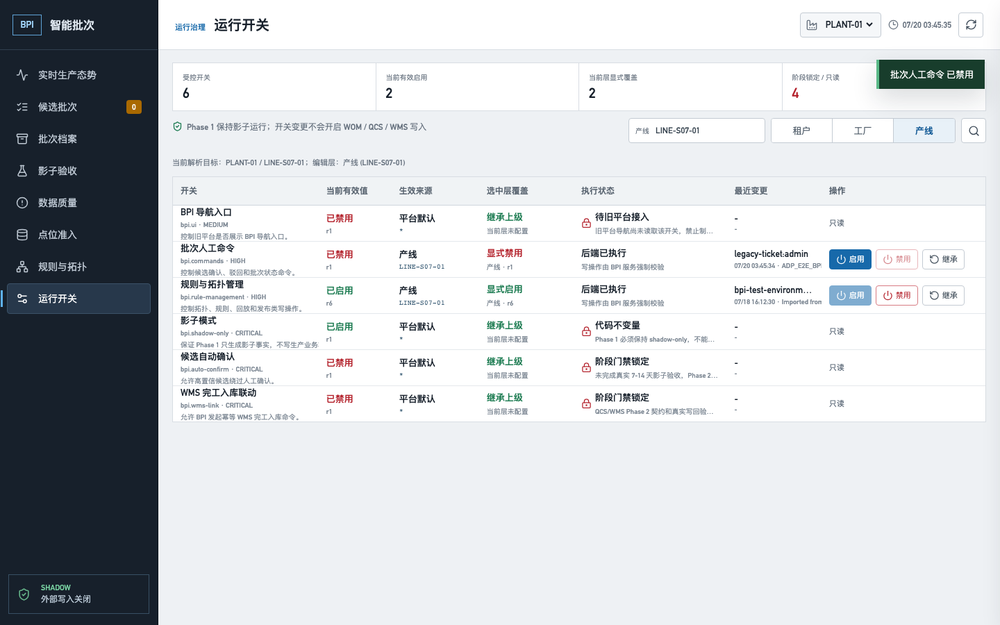
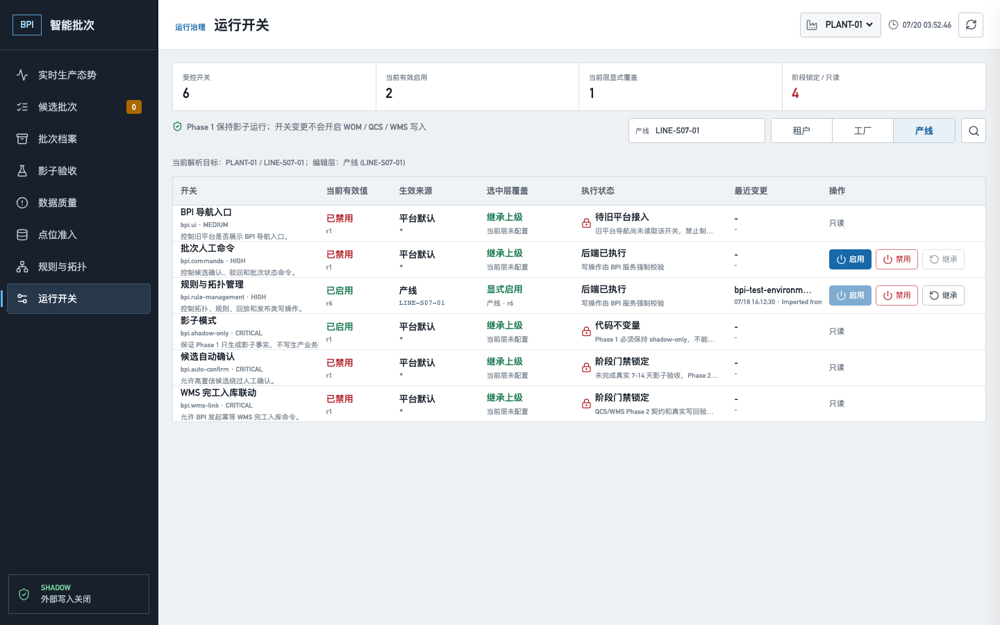
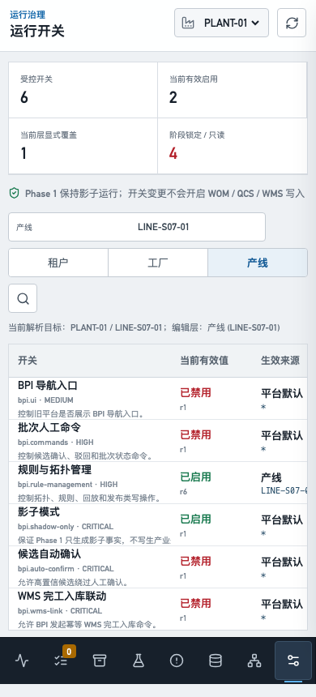

# BPI 运行开关治理目标验收

## 结论

2026-07-20，源码提交 `0cf61838e31623c29fadbc1dbca6b44854716079` 已部署到目标测试环境
`10.11.100.17` 的唯一 `adp-mes-newbase` 运行栈。PostgreSQL `ft_mes_bpi` 通过 expand-only
迁移从 V20 升至 Flyway V21，Java 17 service、Java 8 adapter 和 BPI 静态页面均使用该提交构建。

本轮状态为 **PASS_TARGET_GOVERNED_CLEANED**。真实 ADP 登录页、`/bpi/#/featureFlags`、
`/bpi-api`、Java 后端和 PostgreSQL 完成 LINE 级禁用与恢复继承；写入 1 条开关覆盖、2 条审计、
2 条成功幂等记录，随后只按 marker 定向清理为 `0/0/0`。全局 6 个开关种子和验收前已经存在的
`bpi.rule-management` 产线覆盖保持不变。机器证据见
[`metadata/bpi-feature-flag-governance-acceptance.json`](../../metadata/bpi-feature-flag-governance-acceptance.json)。

## 发布与边界

| 项目 | 实际结果 | 状态 |
|---|---|---|
| 运行栈 | `adp-mes-newbase`；没有创建第二套 ADP/BPI 应用栈 | PASS |
| 数据库 | PostgreSQL 15.18，`ft_mes_bpi`，Flyway V21，22 个迁移校验通过 | PASS |
| 镜像溯源 | service `sha256:947ba1...1418`、adapter `sha256:72c011...0ffc`，OCI revision 均为完整提交 `0cf61838...16079` | PASS |
| 健康 | service `UP`，adapter `UP` | PASS |
| 备份 | 升级前 dump 已保留，SHA-256 为 `246a9736...249` | PASS |
| 生产写边界 | WOM/QCS/WMS/PLC/DCS 写入均为 0；Phase 1 锁定影子模式 | PASS |

自检时发现第一版手工 OCI revision 标签写错。随后使用相同源码和已缓存构建层重新生成最终镜像，
以完整 Git SHA 标记，重新创建两个容器，并再次通过健康、桌面和移动浏览器验收。该修正不涉及数据库
或业务内容变化；最终发布证据为
`/home/v6/adp-evidence/ADP_E2E_BPI_FLAGS_20260719T194145Z_DEPLOY.txt`。

## 功能验收

唯一 marker：`ADP_E2E_BPI_FLAGS_20260720_034527_0cf61838`。

| 页面/动作 | API | 请求关键字段 | 实际结果 | 状态 |
|---|---|---|---|---|
| 运行开关列表 | `GET /bpi-api/feature-flags?plantId=PLANT-01&lineId=LINE-S07-01&scopeType=LINE` | tenant 由认证上下文解析 | 显示 6 个开关；2 个可编辑，4 个阶段锁定/只读；WMS 锁定行无操作按钮 | PASS |
| LINE 级禁用批次人工命令 | `POST /bpi-api/feature-flags/bpi.commands` | `If-Match: 0`，`mode=SET`，`enabled=false` | HTTP 200；生效来源 LINE；显式覆盖 active；revision `1` | PASS |
| 恢复上级继承 | 同上 | `If-Match: 1`，`mode=INHERIT` | HTTP 200；当前覆盖 inactive/r2；有效来源恢复 GLOBAL | PASS |
| 最终读取 | 同 GET | LINE 解析范围 | 页面为 GLOBAL 禁用、当前层未配置；清理后的 override 不再返回 | PASS |

两次 POST 分别使用不同幂等键；操作者由真实旧平台票据映射为 `legacy-ticket:admin`，凭据、cookie 和
token 的值均未写入仓库。解析优先级为 `GLOBAL < TENANT < PLANT < LINE`。

## 落库验收

后端链路：

`FeatureFlagController.change -> FeatureFlagService.change -> FeatureFlagPostgresRepository/BpiPostgresRepository`

目标表：

- `bpi.bpi_feature_flags`
- `bpi.bpi_audit_events`
- `bpi.bpi_api_idempotency`

验收 SQL：

```sql
SELECT tenant_id, scope_type, scope_key, flag_key,
       enabled, active, revision, updated_by, last_reason
FROM bpi.bpi_feature_flags
WHERE last_reason LIKE 'ADP_E2E_BPI_FLAGS_20260720_034527_0cf61838%';

SELECT action, before_revision, after_revision, actor, reason
FROM bpi.bpi_audit_events
WHERE reason LIKE 'ADP_E2E_BPI_FLAGS_20260720_034527_0cf61838%';

SELECT idempotency_key, status, response_status
FROM bpi.bpi_api_idempotency
WHERE idempotency_key IN (
  '28139cdb-550b-497e-bc26-90dbfce5f51b',
  '959f73f6-2c4c-4da5-b995-b39fa94f2915'
);
```

| 时点 | 开关覆盖 | 审计 | 幂等 | 结果 |
|---|---:|---:|---:|---|
| 恢复继承后、清理前 | 1 条 inactive/r2 | 2 条 | 2 条 `COMPLETED/200` | PASS |
| marker 定向清理后 | 0 | 0 | 0 | PASS |
| 清理后基线 | 全局开关 6；既有 `bpi.rule-management` LINE 覆盖仍在 | 不适用 | 不适用 | PASS |

## 浏览器验收

| 视口 | 页面结果 | 错误结果 | 状态 |
|---|---|---|---|
| 桌面 `1440x900` | 6 个开关、8 个导航项；最终为 GLOBAL 继承态 | BPI console/page/request/HTTP error 均为 0 | PASS |
| 移动 `390x844` | 6 个开关、8 个底部导航项；表格在自身容器横向滚动 | document/body 均为 `390/390`，页面级横向溢出 0；BPI 四类错误均为 0 | PASS |

真实登录返回 200 且存在 `suposTicket` cookie。登录成功导航时旧 ADP 页面有 2 个装饰资源
`net::ERR_ABORTED`，已按 URL 精确分类为预期导航中止；unexpected request failure 为 0。
最初 SET 脚本在登录后立即切入 BPI，额外中止 2 个仍在飞行中的旧 i18n 请求，因此原始动作报告为
4 个 `ERR_ABORTED`；隔离登录复跑后稳定为上述 2 个装饰资源、unexpected 为 0。两次均无 BPI
console/page/HTTP 错误，这一差异保留在机器证据中，没有被删改成“全零”。







## 本报告当时尚未关闭

- 本报告验收时 `bpi.ui` 保持只读 `PENDING_SHELL_INTEGRATION`：旧 ADP 菜单壳当时尚未读取该开关，
  因此本报告没有伪报为已执行。该缺口随后已由提交 `df6fdb0e5ddb929626dd0ea3c81b170afbaa62a4`
  在 Java 8 adapter 的旧 MES 原生菜单读取点关闭，独立证据见
  [BPI 旧 MES 原生菜单开关目标验收](bpi-shell-menu-gate-acceptance.md)。
- `bpi.shadow-only=true`、`bpi.auto-confirm=false`、`bpi.wms-link=false` 是 Phase 1 不可编辑门禁。
- 本轮证明治理页面、接口、执行点和 PostgreSQL 落库，不代替现场连续 7-14 天影子运行与生产签字。
