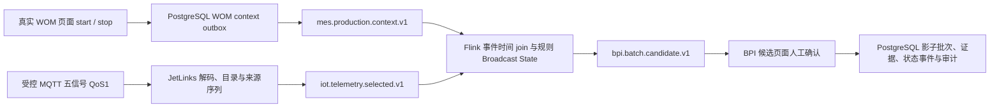

# BPI 最小转运单元多信号与真实 MES 批次联合验收

- 验收时间：2026-07-27
- 目标环境：`10.11.100.17` / `v6-2288H-V6`
- MES 实现基线：`2a81b1b8`
- IoT 实现基线：`3d6e1108`
- 数据库：ADP PostgreSQL `adp` + BPI PostgreSQL `ft_mes_bpi` + JetLinks PostgreSQL `jetlinks`
- 唯一 marker：`BPI_MIN_20260727_110711`
- 结论：`PASS_CONTROLLED_MULTI_SIGNAL_WOM_TO_SHADOW_BATCH`

## 结论与边界

本轮把单点流量验证扩展为一个可持续发信号、可配置边界规则、能关联真实 MES 制造指令的最小工艺单元：

```text
送料罐 -> 送料泵 -> 流量计 -> 转运阀路 -> 接收罐
```

受控 MQTT 每个 envelope 同时携带瞬时流量、累计流量、泵运行、阀路成立和接收罐液位五个信号。
真实 WOM 页面产生运行/结束生产上下文，Flink 按事件时间把遥测与上下文关联，再按已发布拓扑和规则生成
START/END 候选。两个候选均由真实 BPI 页面确认，PostgreSQL 中同一影子批次完成
`ACTIVE/r1 -> CLOSED_RAW/r2`。

该结果证明当前 BPI 与 MES 的关联不是页面跳转或直接表关联，而是由两个版本化事件流在 Flink 中完成：



本轮来源仍是受控模拟器，校准证据仍是测试专用证据。所有 WOM/QCS/WMS/PLC/DCS 生产写回均关闭，
所以 BPI 总目标继续保持 `PARTIAL`，不能据此声明物理现场或生产 READY。

## 最小单元模型

| 节点/信号 | 规范属性 | 类型 | 单位 | 在边界中的作用 |
|---|---|---|---|---|
| 流量计瞬时流量 | `flow.instant` | double | `m3/h` | START quorum；END required |
| 流量计累计量 | `flow.totalizer` | double | `m3` | START quorum，验证累计量上升 |
| 送料泵运行 | `pump.running` | boolean | `bool` | START required；END quorum |
| 转运阀路成立 | `valve.path.ready` | boolean | `bool` | START required；END quorum |
| 接收罐液位 | `tank.level` | double | `%` | START quorum，验证目标罐开始接料 |

拓扑、信号、规则和 25 个分阶段样本均来自
[`simulation/bpi/scenarios/minimum-transfer-cell-v1.json`](../../simulation/bpi/scenarios/minimum-transfer-cell-v1.json)。
场景 checksum 为
`2b728461e969f08f53b746b599afde249f897dc409e2fa29cfe5c628c006be8c`。

START 规则：

- `pump.running=true` 持续 4 秒，必需；
- `valve.path.ready=true` 持续 4 秒，必需；
- `flow.instant>12 m3/h`、`flow.totalizer` 上升至少 `0.2 m3`、`tank.level` 上升至少 `0.05%`
  三项中满足至少两项；
- 最低置信度 `0.8`。

END 规则：

- `flow.instant<0.5 m3/h` 持续 4 秒，必需；
- 泵停止或阀路断开至少满足一项；
- 最低置信度 `0.7`。

规则不是按分钟轮询数据库。遥测由 MQTT 主动推送，经 Kafka 进入 Flink；Flink 使用事件时间、
watermark、按 key 状态和 timer 持续评估保持时长。数据库保存结果和审计，不承担高频规则轮询。

## 功能验收

| 模块 | 页面/路由 | 操作 | API / 事件 | 前端结果 | 后端与 PostgreSQL 结果 | 状态 |
|---|---|---|---|---|---|---|
| 五点目录 | `/bpi/#/points` | 注册五个源属性，发布目录和来源序列证据 | JetLinks metadata/catalog/source-sequence publishers | 五点均可进入 READY | 5 个目录点均为 VERIFIED/QUALIFIED/READY | PASS |
| 拓扑与规则治理 | `/bpi/#/rules` | 发布五节点拓扑；模拟、审批并发布 START/END 规则 | topology/rule/calibration/feature APIs | 两个模拟均 1 命中、0 漏检、0 误报 | 两条规则均到 PUBLISHED/APPLIED/READY | PASS |
| WOM 运行上下文 | `/msService/WOM/produceTask/produceTask/makeTaskList` | 对 marker 指令执行开始 | `POST .../updateTaskState`，`state=start` | 登录、导航、动作均 200；浏览器错误 0 | 任务为 runing；waitforrun inactive 与 runing active 两条 outbox 均 SENT/1 | PASS |
| 连续五信号输入 | MQTT | 发送 START_CONFIRM + RUNNING，sequence `7..21` | MQTT QoS1 -> JetLinks -> Kafka | 15/15 PUBACK | 五类点位进入真实流处理；产生 START 候选 | PASS |
| START 边界 | `/bpi/#/candidates` | 打开候选抽屉并确认 | `POST /bpi-api/candidates/0dfd8cb9-59fc-5486-8f4b-9d93abf7d565/confirm` | HTTP 200；console/page/request failure 均 0 | candidate CONFIRMED/r2；batch `0ed2...e77c` 为 ACTIVE/r1/is_shadow=true | PASS |
| END 事件时间 | MQTT | 发送两组 STOP_CONFIRM，sequence `22..35` | MQTT QoS1 -> JetLinks -> Kafka/Flink | 14/14 PUBACK | 第一组满足 4 秒条件，第二组推进 watermark；边界时间仍是第一组的 `11:35:19.354` | PASS |
| END 边界 | `/bpi/#/candidates` | 打开候选抽屉并确认 | `POST /bpi-api/candidates/a838687a-7895-52de-b821-23eaf3c95e3c/confirm` | HTTP 200；console/page/request failure 均 0 | 同一 batch 变为 CLOSED_RAW/r2，保留 WOM order ID | PASS |
| WOM 结束与恢复 | WOM 页面 + BPI 治理 | 执行 stop；退役规则、撤销校准、恢复开关 | WOM stop + rule/calibration/feature APIs | WOM stop 200；页面错误 0 | finished inactive outbox SENT/1；规则 RETIRED/INACTIVE；校准 REVOKED；无 pending/active | PASS |

START 页面证据：
[`metadata/bpi-minimum-transfer-cell-start-target.png`](../../metadata/bpi-minimum-transfer-cell-start-target.png)。

END 页面证据：
[`metadata/bpi-minimum-transfer-cell-end-target.png`](../../metadata/bpi-minimum-transfer-cell-end-target.png)。

## WOM 落库

真实 WOM 页面使用任务：

```text
task id = 9007190231280101
order id = BPI_MIN_20260727_110711_TASK_TN
line id  = 8388157374858567
```

页面开始后任务和待入库记录为 `WOM_runState/runing`；页面结束后两者均为
`WOM_runState/finished`。上下文 outbox 查询：

```sql
SELECT context_revision, active, source_state, publication_state,
       attempt_count, sent_at
FROM public.wom_bpi_production_context_outbox
WHERE order_id = 'BPI_MIN_20260727_110711_TASK_TN'
ORDER BY context_revision;
```

结果摘要：

```text
1785123132513 | false | wom_runstate/waitforrun | SENT | 1
1785123152841 | true  | wom_runstate/runing     | SENT | 1
1785123688204 | false | wom_runstate/finished   | SENT | 1
```

取证后 WOM fixture 已定向删除，task、wait、formula、material 均为 0；三条 outbox 作为已发布事件审计保留。

## 五信号遥测落库

首轮真实闭环暴露出累计量单位 `m3` 未在 BPI accepted-unit 默认白名单中的问题，事件因此是 4/5 接受。
提交 `2a81b1b8` 将 `m3/m³` 纳入同一规范化语义和 Compose 配置。IoT 提交 `3d6e1108` 修复 boolean
JetLinks metadata 不提供数值单位时的目录单位保留，但属性不存在时仍失败关闭。

修复后发送 sequence `36..42` 七个 envelope，每个含五个点：

```sql
SELECT message_id, status, point_count,
       accepted_point_count, rejected_point_count,
       source_epoch, sequence
FROM bpi.bpi_telemetry_events
WHERE message_id LIKE 'BPI_MIN_20260727_110711_ACCEPT5:%'
ORDER BY sequence;
```

七行均为：

```text
status=ACCEPTED
point_count=5
accepted_point_count=5
rejected_point_count=0
```

点位汇总：

```text
flow.instant     DOUBLE  0.2    m3/h  GOOD  7
flow.totalizer   DOUBLE  105.6  m3    GOOD  7
pump.running     BOOLEAN false  bool  GOOD  7
tank.level       DOUBLE  41.4   %     GOOD  7
valve.path.ready BOOLEAN false  bool  GOOD  7
reject rows = 0
```

这证明一条 MQTT envelope 可以携带五个不同类型的工艺信号，并以同一 source epoch/sequence 原子地形成
7 events、35 accepted points 和 0 rejects。

## 候选与批次落库

```sql
SELECT id, boundary_type, order_id, state, revision,
       candidate_key, batch_id, boundary_time, confidence
FROM bpi.bpi_batch_candidates
WHERE id IN (
  '0dfd8cb9-59fc-5486-8f4b-9d93abf7d565',
  'a838687a-7895-52de-b821-23eaf3c95e3c'
)
ORDER BY boundary_time;

SELECT id, batch_no, order_id, state, revision, is_shadow,
       start_time, end_time, quality_gate, wms_status
FROM bpi.bpi_batch_instances
WHERE id = '0ed2b956-9e1b-53fb-805c-9ff5e1f5e77c';

SELECT revision, action, from_state, to_state, event_time
FROM bpi.bpi_batch_state_events
WHERE batch_id = '0ed2b956-9e1b-53fb-805c-9ff5e1f5e77c'
ORDER BY revision;
```

结果：

```text
START candidate 0dfd...d565 CONFIRMED/r2 confidence 0.85
END   candidate a838...e3c CONFIRMED/r2 confidence 0.70
batch 0ed2...e77c / BPI-LINES0701-20260727-E22B71C8
order BPI_MIN_20260727_110711_TASK_TN
CLOSED_RAW/r2/is_shadow=true
start 2026-07-27 11:33:28.905+08
end   2026-07-27 11:35:19.354+08
quality_gate=NOT_APPLICABLE
wms_status=NOT_REQUESTED
```

状态事件恰好两条：

```text
r1 SHADOW_BATCH_CREATED      null   -> ACTIVE
r2 END_BOUNDARY_CONFIRMED    ACTIVE -> CLOSED_RAW
```

START 证据包含阀路、瞬时流量、泵和液位；累计量当时未满足候选证据窗口，但规则规定的 2/3 quorum
已由瞬时流量和液位满足。END 证据包含低流量和泵停止，满足 required + 1 quorum。

## 写回隔离与恢复

按 batch ID 直接查询：

```text
bpi_quality_gates                 = 0
bpi_quality_links                 = 0
bpi_wms_inbound_links             = 0
bpi_wms_inbound_reversal_tasks    = 0
WMS topic bpi_outbox_events       = 0
```

最终恢复状态：

- 两条规则均 `RETIRED/r5`，Flink runtime 均 `INACTIVE`；
- 五条测试校准均 `REVOKED/r3`；
- `bpi.commands` 恢复 `effective=false/overrideActive=false/r8`；
- `bpi.rule-management` 保持验收前 `effective=true/overrideActive=true/r6`；
- pending candidate 为 0，active batch 为 0；
- 发布拓扑作为版本化最小模型保留，但没有活动规则；
- 两条 CONFIRMED candidate、一个 CLOSED_RAW 影子批次及其证据/审计作为不可变验收事实保留。

治理脚本现在会在中断重跑时复用相同证书引用的非撤销校准，并可从前次报告或显式审计恢复值中重建
开关基线；重复 cleanup 会识别已恢复状态，不再制造额外 revision。

## Flink 运行状态

验收后实时复验：

```text
job id: 40f36698aeee4aaae17eac52608c7939
state: RUNNING
tasks: 36/36
latest completed checkpoint: 25206
acknowledged subtasks: 36
completed checkpoints: 16200
failed checkpoints: 0
```

第二组 STOP_CONFIRM 不是业务补偿，而是事件时间系统的 watermark 推进样本。第一组已经满足保持条件，
候选最终使用第一组的边界时刻；后续应把“结束后最少补发若干心跳/idle source 处理”纳入现场网关协议，
避免低频或停流设备让 END 候选等待 watermark。

## 已知缺口

1. `bpi_telemetry_points.unit` 已真实保存五类单位，但 `bpi_boundary_evidence.unit` 当前为空。
   候选值、信号、质量和时间均正确，状态机不受影响；不过这是不可变证据可解释性的缺口，正式生产前应
   将权威单位和校准身份投影到边界证据并补 expand-only 迁移与回归。
2. 本轮只有一个工艺单元、一条逻辑产线和短时受控输入，没有证明十几条产线、十几万测点下的容量、
   backpressure、热点 key、重平衡和长期状态大小。
3. 测试校准不等于现场计量证书；模拟器不等于物理 DEVICE/GATEWAY、断线重连和掉电恢复。
4. 当前真实批次是影子批次。WOM/QCS/WMS/PLC/DCS 写回仍必须保持关闭。

## 下一验收门槛

1. 用物理设备按同一五信号契约重复 source epoch/sequence、断线重连和掉电恢复。
2. 将现场校准证书与准确目录版本绑定，并由独立人员审批。
3. 补边界证据单位/校准投影后，对历史 replay 和新批次做兼容验证。
4. 选一条产线连续运行 7-14 天，累计人工复核批次和 START/END 认同率、时间偏差、累计量偏差。
5. 再扩到多产线容量、灾备和外部 QCS/ERP-WMS；业务签字前不开放生产写回。

机器可读证据：
[`metadata/bpi-minimum-transfer-cell-live-acceptance.json`](../../metadata/bpi-minimum-transfer-cell-live-acceptance.json)。

目标机原始证据目录：
`/home/v6/bpi-acceptance/BPI_MIN_20260727_110711`。文件 SHA-256 已写入机器记录，报告中不保存任何
MQTT 密钥或登录口令。
