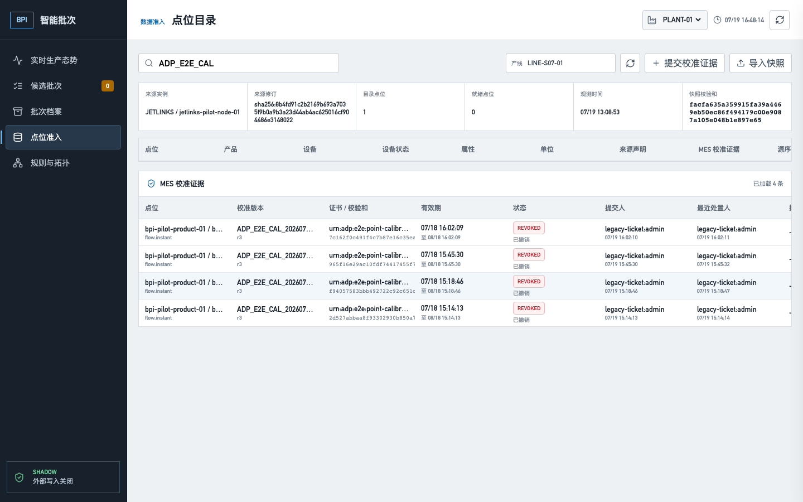

# BPI 点位校准高基数分页验收

## 结论

2026-07-19 在目标环境 `10.11.100.17` 完成点位校准列表高基数分页验收，结论为
**`PASS_CONTROLLED_TARGET_READ_ONLY`**。marker
`ADP_E2E_CAL_PAGE_20260719_164813` 使用真实 ADP 登录、真实 Java 8 adapter、Java 17 service、
PostgreSQL 以及 `/bpi/#/points` 页面完成：

```text
GET 第一页 limit=2
  -> PostgreSQL transaction_timestamp() 固定 snapshotAt
  -> 返回两条记录和 HMAC 签名 nextCursor
  -> GET 第二页沿 (submitted_at DESC, id DESC) keyset 继续
  -> 同一 snapshotAt、两条新记录、nextCursor=null
  -> 页面合并去重并保留搜索值
```

两页共读取 4 条、唯一 ID 为 4；篡改游标和跨 product 筛选复用游标均返回 `422`。
浏览器 console error、page error、request failure 均为 0。机器记录见
[`metadata/bpi-point-calibration-pagination-acceptance.json`](../../metadata/bpi-point-calibration-pagination-acceptance.json)。

## 页面与 API

| 页面/入口 | 操作 | 实际结果 | 状态 |
|---|---|---|---|
| `/bpi/#/points` | 初始读取校准证据 | `GET /bpi-api/point-calibrations?...&limit=2` 返回 2 条与 `nextCursor` | PASS |
| `/bpi/#/points` | 点击“加载更多” | 带 cursor 请求第 2 页，追加后共 4 条且无重复 | PASS |
| 点位搜索框 | 分页前输入 `ADP_E2E_CAL` | 重绘后输入值保持，筛选继续生效 | PASS |
| adapter API | 篡改 cursor | `422`，精确拒绝无效签名 | PASS |
| adapter API | 改变 productId 后复用 cursor | `422`，精确拒绝 scope 不匹配 | PASS |

页面验收只把真实请求的 `limit=50` 改为 `2`，用于在目标现有 4 条记录上强制触发多页；
没有拦截或伪造响应。截图显示最终“已加载 4 条”且不再出现“加载更多”。



## PostgreSQL

Flyway 从 V17 expand-only 升到 V18，新增与过滤前缀和排序一致的索引：

```sql
CREATE INDEX idx_bpi_point_calibrations_scope_cursor
    ON bpi.bpi_point_calibrations
       (tenant_id, plant_id, line_id, submitted_at DESC, id DESC);
```

目标直查确认 `indisvalid=true`、`indisready=true`，Flyway 历史为 `18|true`。分页 SQL 使用：

```sql
SELECT id, submitted_at, state, revision
FROM bpi.bpi_point_calibrations
WHERE tenant_id = '1000'
  AND plant_id = 'PLANT-01'
  AND line_id = 'LINE-S07-01'
ORDER BY submitted_at DESC, id DESC;
```

API 返回顺序与 PostgreSQL 直查一致。验收前后该 scope 均为 4 行，测试只发 GET，业务数据变化为 0。

## 游标语义

- 第一页在数据库事务中取得 `transaction_timestamp()`，后续页复用同一 `snapshotAt`。
- keyset 使用 `(submitted_at, id)`，避免深分页 `OFFSET` 扫描与并发插入造成的重复/跳行。
- cursor 绑定 tenant、plant、line、product、device、property 完整筛选 scope。
- cursor 以现有 BPI internal JWT secret 做 `HMAC-SHA256` 签名，不接受篡改、超长或跨 scope 使用。
- 默认页长 50，最大 200；后端读取 `limit + 1` 判断是否还有下一页。

稳定快照冻结的是列表成员和顺序。若另一条命令在翻页期间改变已有记录状态，后续页读取的是该行当前状态；
它不是全程长事务或历史行版本浏览。

## 构建与回归

- Java 17 Maven：事件契约 17、规则运行时 9、service 57，总计 83，失败 0。
- 真实 PostgreSQL 游标验收覆盖并发插入、无重复、跨 scope、篡改和 `limit > 200`。
- 模拟器 9/9，Chromium E2E 11/11，前端生产构建 PASS。
- `verify-bpi-service.py`、OpenAPI/API catalog 契约门禁和 `git diff --check` PASS。
- 目标镜像 `ft-mes-bpi-service:20260719-calibration-cursor-v18` healthy；运行 JAR SHA-256 为
  `93796f672c8ac8ab494bf1baf3606ad354a8cb6e89de5701ca4b040fb6ccaabb`。

## 未闭合边界

- 本轮只解决校准证据列表的高基数读取；点位目录快照仍有独立 payload 上限和后续分页空间。
- 当前 4 条均是已撤销的受控测试证据，不能解释为现场有效校准。
- 真实现场证书、强制连续单调 DEVICE/GATEWAY 来源序列、同 scope candidate/batch 和 7-14 天影子运行仍未完成。
- 没有生成 candidate/batch，也没有写 WOM、QCS 或 WMS。

因此 `G-021` 继续保持 `PARTIAL`，本次 PASS 只关闭校准证据列表的稳定、高基数读取风险。
