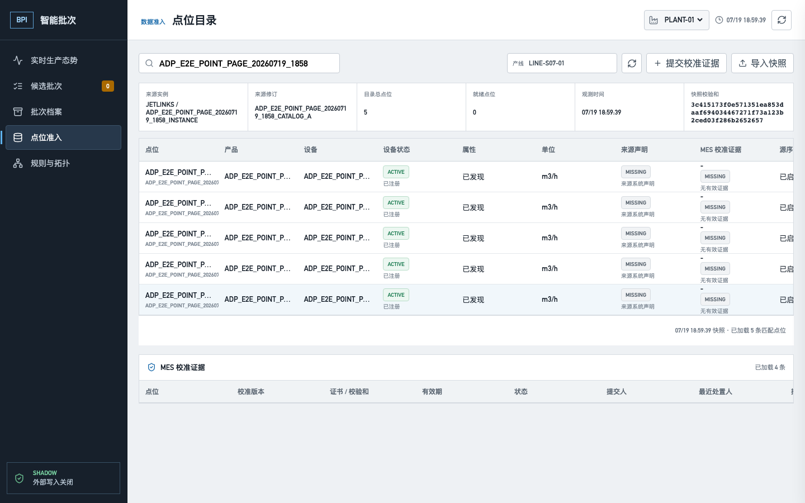

# BPI 点位目录高基数分页验收

## 结论

2026-07-19 在目标环境 `10.11.100.17` 完成点位目录高基数读取验收，结论为
**`PASS_TARGET_CLEANED`**。marker `ADP_E2E_POINT_PAGE_20260719_1858` 通过真实 ADP 登录、
Java 8 adapter、Java 17 BPI service、PostgreSQL 15.18 和 `/bpi/#/points` 页面完成：

```text
5 点不可变快照
  -> GET limit=2 + search
  -> 2 + 2 + 1，固定 snapshot id / snapshotAt，5 个 ID 无重复
  -> 浏览器连续“加载更多”，最终显示 5 条并保留搜索词
  -> 导入更新快照后，旧 cursor 继续读取旧快照，fresh GET 读取新快照
  -> 篡改 cursor / 改 search 复用 cursor 均返回 422
  -> 定向清理 marker，原 1 点快照恢复为 current
```

机器记录见
[`metadata/bpi-point-catalog-pagination-acceptance.json`](../../metadata/bpi-point-catalog-pagination-acceptance.json)，
页面截图如下。



## 页面与 API

| 页面/入口 | 操作 | 实际结果 | 状态 |
|---|---|---|---|
| `/bpi/#/points` | 搜索 marker | 服务端从完整快照检索，首屏显示 2 条，不只过滤浏览器已加载行 | PASS |
| `/bpi/#/points` | 连续点击“加载更多” | 按 cursor 追加为 4、5 条；ID 无重复，末页移除按钮 | PASS |
| 点位搜索框 | 分页和重绘 | marker 保持，后续请求继续携带同一 search | PASS |
| adapter API | 读取 3 页 | `2 + 2 + 1`，snapshot id 与 snapshotAt 全程相同 | PASS |
| adapter API | 篡改 cursor | HTTP `422` | PASS |
| adapter API | 改变 search 后复用 cursor | HTTP `422` | PASS |
| adapter API | 新快照导入后继续旧 cursor | 仍返回第一快照；fresh GET 返回第二快照 | PASS |
| 旧调用方式 | 不传 search/cursor/limit | 仍返回当前快照完整 points，兼容行为未变 | PASS |

真实浏览器共发出 4 个目录请求，其中 2 个带 cursor；console error、page error 和 request
failure 均为 0。页面只在验收脚本中把前端的生产页长 100 改成 2，以便用 5 条受控数据强制出现三页，
没有拦截或伪造响应内容。

## PostgreSQL

生产查询按已有复合索引的前缀和顺序执行：

```sql
WHERE tenant_id = :tenantId
  AND snapshot_id = :snapshotId
  AND (product_id, device_id, property_id)
      > (:cursorProductId, :cursorDeviceId, :cursorPropertyId)
ORDER BY product_id, device_id, property_id
LIMIT :limitPlusOne;
```

搜索范围包括产品、设备、属性、来源属性、点位名称和 locality group。每页读取 `limit + 1` 判断
是否还有后续页；没有新增 Flyway 迁移，继续复用 V10 的
`idx_bpi_point_catalog_entry_lookup (tenant_id, snapshot_id, product_id, device_id, property_id)`。
目标 Flyway 仍为 `18|true`。

验收后执行
[`bpi-point-catalog-pagination-cleanup.sql`](../../deploy/docker/scripts/bpi-point-catalog-pagination-cleanup.sql)：

| 清理对象 | 删除 | 剩余 marker |
|---|---:|---:|
| `bpi_point_catalog_snapshots` | 2 | 0 |
| `bpi_point_catalog_entries` | 6 | 0 |
| `bpi_audit_events` | 2 | 0 |
| `bpi_api_idempotency` | 2 | 0 |

清理后 PostgreSQL 与 adapter API 当前快照均恢复为验收前 ID
`ca213975-4b22-4230-8cd9-968b0d1ce61a`，仍为 1 点且没有 nextCursor。

## 游标与兼容边界

- cursor 固定不可变 snapshot UUID，并携带最后一个 `(productId, deviceId, propertyId)` 键。
- HMAC-SHA256 使用域 `bpi.point-catalog.cursor.v1`，签名密钥不进入前端和响应正文。
- scope fingerprint 绑定 tenant、plant、line 和标准化 search；授权仍在每页重新检查。
- 默认页长 100、最大 200，search 最长 128 字符。
- 前端点位页显式启用分页；规则和拓扑既有调用不传分页参数，继续获得完整快照。
- 翻页期间出现新 current snapshot 不会造成旧结果跳行或混页；新查询才切换到新快照。

## 构建与回归

- BPI Maven reactor：事件契约 17、规则运行时 9、service 58，共 84 个测试，失败 0。
- `BpiPointCatalogPostgresAcceptanceTest` 3/3，覆盖真实 PostgreSQL keyset、快照固定、搜索作用域、
  游标篡改、上限和旧响应兼容。
- Vite 生产构建 PASS；模拟器与 Chromium E2E `12/12 PASS`。
- `verify-bpi-service.py`、`verify-bpi-ui.py`、OpenAPI JSON 和 `git diff --check` PASS。
- 目标镜像 `ft-mes-bpi-service:20260719-point-catalog-cursor` healthy，service health 为 `UP`；
  运行 JAR SHA-256 为 `14b70c40f8610dd5f071182c1c04ce01872e651e3fd6c914d3f52c003a9392b2`。
- 目标前端资产为 `assets/index-BHVgjfWe.js`，adapter 保持 healthy 且未重启。

## 未闭合边界

- 本轮关闭的是点位目录读取高基数风险；点位快照导入仍是单请求完整 payload，并受 5 MiB 消息上限约束。
- 目标恢复后的真实目录仍只有 1 点，且现场校准与强制连续来源序列未就绪，不能解释为现场点位 READY。
- 没有生成 candidate/batch，也没有写 WOM、QCS、WMS 或现场 IoT 配置。
- 7-14 天影子运行、跨系统业务链和整体回滚演练仍未完成。

因此该能力验收为 PASS，但 `G-021` 继续保持 `PARTIAL`。
