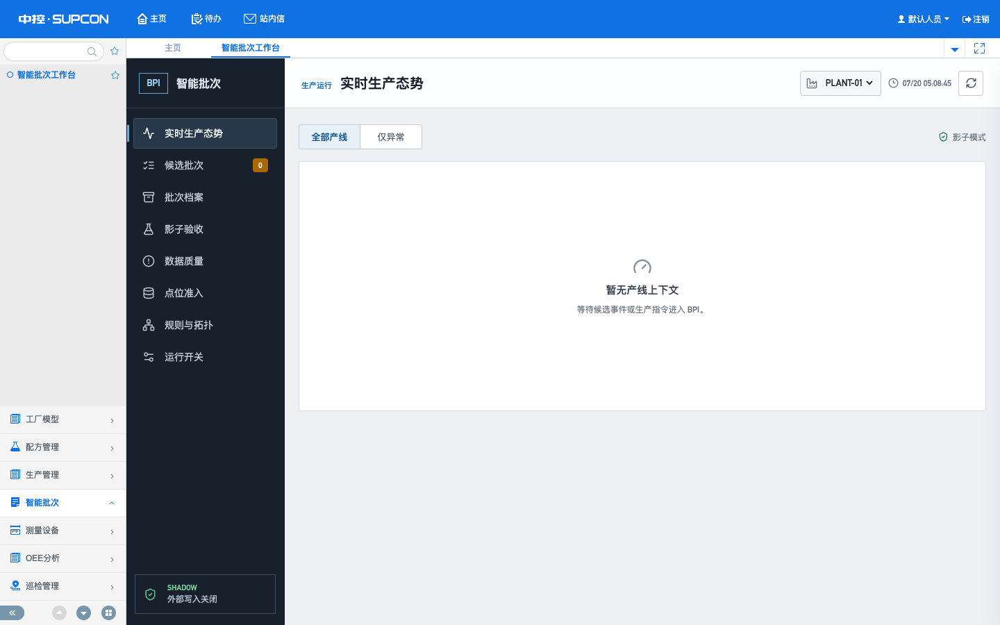
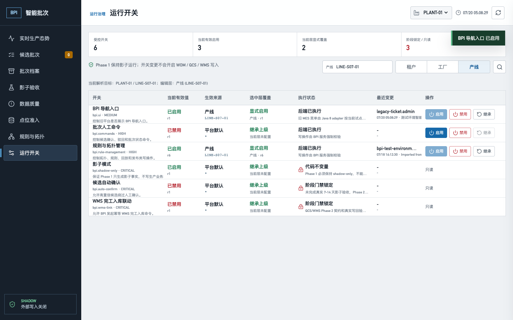
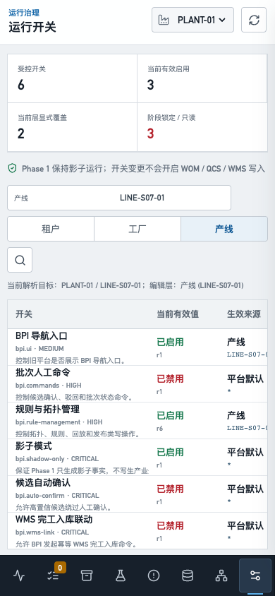

# BPI 旧 MES 原生菜单开关目标验收

## 结论

2026-07-20，提交 `df6fdb0e5ddb929626dd0ea3c81b170afbaa62a4` 已部署到
`10.11.100.17` 的唯一 ADP 应用栈 `adp-mes-newbase`。真实登录、旧 MES 原生菜单、BPI
运行开关页面、Java 8 adapter、Java 17 service 和 PostgreSQL 15.18/Flyway V21 共同完成
`bpi.ui` 的隐藏、启用、禁用、恢复继承、适配器故障回退和最终测试配置保留，结论为
**PASS_TARGET_NATIVE_SHELL_GOVERNED**。

本验收关闭的是旧 MES 导航可见性控制，不把它扩大为 API 授权、自动确认、QCS/WMS 写回或
PLC/DCS 控制。机器证据见
[`metadata/bpi-shell-menu-gate-acceptance.json`](../../metadata/bpi-shell-menu-gate-acceptance.json)。

## 部署与回滚准备

| 项目 | 实际结果 | 状态 |
|---|---|---|
| 源码 | 两个镜像 OCI revision 均为 `df6fdb0e5ddb929626dd0ea3c81b170afbaa62a4` | PASS |
| Java 17 service | `ft-mes-bpi-service:20260720-shell-menu-df6fdb0e`，image ID `sha256:b4c2e588...7d586`，healthy | PASS |
| Java 8 adapter | `ft-mes-bpi-adapter:20260720-shell-menu-df6fdb0e`，image ID `sha256:622320e4...0da1`，healthy | PASS |
| PostgreSQL | `15.18`，Flyway 保持 V21，本次没有数据库迁移 | PASS |
| 部署前备份 | `/home/v6/bpi-deploy-backups/20260720-044859-shell-menu-df6fdb0e/ft_mes_bpi.dump`，139076 bytes，SHA-256 `fe4df854...c1c08`，restore list 已验证 | PASS |
| Flink 隔离 | job `1e981b842f4693e49f3c3def0fb98cb6` 始终 `RUNNING 36/36`，本次未重启流处理栈 | PASS |

只切换了 BPI service、adapter、Nginx 配置和 BPI 静态页面。WOM、QCS、WMS、Kafka/Flink
及其数据没有因本次部署重建。

## 真实页面验收

唯一测试 marker：`ADP_E2E_BPI_SHELL_20260720_050100_df6fdb0e`。

| 阶段 | 页面操作 | API / 响应 | 原生菜单结果 | 状态 |
|---|---|---|---|---|
| 初始隐藏 | 正常登录旧 MES | `GET /inter-api/rbac/v1/menus/currentUser` 为 `200` | 28 个原菜单、0 个 BPI；`X-BPI-UI-Gate: HIDDEN_DISABLED` | PASS |
| 恢复入口 | 直接访问 `/bpi/#/featureFlags` | 列表 `200`；`bpi.ui` 为 ENFORCED、可编辑 | 菜单隐藏时仍可从固定恢复路径操作 | PASS |
| 启用 | 页面选择 LINE 层，执行 SET true | `POST /bpi-api/feature-flags/bpi.ui`，`If-Match: 0`，`200/r1` | 29 个菜单、恰好 1 个 BPI；`VISIBLE_INJECTED` | PASS |
| 进入工作台 | 点击“智能批次”及“智能批次工作台” | iframe 打开 `/bpi/#/overview?&workFlowMenuCode=BPI_1.0.0_console&openType=page` | 页面标题为“实时生产态势” | PASS |
| 显式禁用 | 页面执行 SET false | 同一 POST，`If-Match: 1`，`200/r2` | 恢复 28 个原菜单、0 个 BPI；原菜单集合不变 | PASS |
| 恢复继承 | 页面执行 INHERIT | 同一 POST，`If-Match: 2`，`200/r3` | 有效来源恢复 GLOBAL false，仍为 28/0 | PASS |
| 最终配置 | 清理 marker 后从真实页面重新 SET true | 同一 POST，`If-Match: 0`，`200/r1` | 最终测试环境保留 29/1 和 `VISIBLE_INJECTED` | PASS |

三个 marker 动作都携带不同的 `Idempotency-Key`，但报告不保存键值。最终测试配置不是测试
marker 残留，变更依据为“测试环境智能批次导航正式启用，范围 PLANT-01/LINE-S07-01，回滚方式为
LINE 层 INHERIT”。需要退场时应从页面执行 LINE 层 `INHERIT`，不能直接改表。

## PostgreSQL 落库

写链为：

`FeatureFlagController.change -> FeatureFlagService.change -> FeatureFlagPostgresRepository / BpiPostgresRepository`。

菜单读链为：

`BpiShellMenuController.currentUserMenus -> FeatureFlagController.list -> FeatureFlagService.resolve`。

目标表：

- `bpi.bpi_feature_flags`
- `bpi.bpi_audit_events`
- `bpi.bpi_api_idempotency`

关键验收 SQL：

```sql
SELECT tenant_id, scope_type, scope_key, flag_key, enabled, active, revision,
       updated_by, last_reason
FROM bpi.bpi_feature_flags
WHERE last_reason LIKE 'ADP_E2E_BPI_SHELL_20260720_050100_df6fdb0e%';

SELECT action, before_revision, after_revision, actor_id, reason
FROM bpi.bpi_audit_events
WHERE reason LIKE 'ADP_E2E_BPI_SHELL_20260720_050100_df6fdb0e%';

SELECT method, path, status, response_status
FROM bpi.bpi_api_idempotency
WHERE path = '/bpi/v1/feature-flags/bpi.ui'
  AND response_body::text LIKE '%ADP_E2E_BPI_SHELL_20260720_050100_df6fdb0e%';
```

清理前直接查库得到开关/审计/幂等 `1/3/3`，审计 revision 顺序为：

1. `FEATURE_FLAG_ENABLED 0 -> 1`
2. `FEATURE_FLAG_DISABLED 1 -> 2`
3. `FEATURE_FLAG_OVERRIDE_REMOVED 2 -> 3`

单事务按 marker 删除 `1/3/3` 后，三类残留均为 `0`。随后通过真实页面建立最终 LINE 配置，
直接查库为 `enabled=true / active=true / revision=1`，并有各 1 条审计和幂等记录；六条 GLOBAL
种子和既有 `bpi.rule-management` LINE r6 覆盖均未被破坏。

## 故障回退

只停止 `bpi-adapter` 后刷新旧 MES：Nginx 的精确菜单路由通过 `error_page` 回退到 gateway，
请求仍为 `200`，返回 28 个原菜单、0 个 BPI，且没有伪造 `X-BPI-UI-Gate`。恢复 adapter 后其
health 回到 healthy，治理响应头重新出现。该演练没有停止 gateway、service、PostgreSQL 或 Flink。

## 页面质量

| 视口 | 实际结果 | BPI console/page/request/HTTP error | 状态 |
|---|---|---|---|
| 旧 MES `1440x900` | 原生菜单进入 BPI iframe；document 为 `1440/1440 x 900/900`，无页面溢出 | `0/0/0/0` | PASS |
| BPI 恢复页 `390x844` | document/body 均为 `390/390`，无页面级横向溢出；表格仅在自身容器滚动 | `0/0/0/0` | PASS |

登录后旧 portal 的 `GET /inter-api/portal/v1/homePage/userPortal` 仍返回 `401`，并产生一条资源
console error。它是本次 BPI 动作链之外的既有平台问题，已如实记录；“零错误”只针对上述 BPI
动作阶段。未登录直接访问菜单接口返回 `401`。







## 原始证据

- `/home/v6/adp-evidence/ADP_E2E_BPI_SHELL_20260720_050100_df6fdb0e_PRE_CLEAN.txt`，SHA-256 `32e60239...24d2a`
- `/home/v6/adp-evidence/ADP_E2E_BPI_SHELL_20260720_050100_df6fdb0e_CLEANUP.txt`，SHA-256 `b402be53...3083d`
- `/home/v6/adp-evidence/BPI_SHELL_MENU_FINAL_20260720_df6fdb0e_PASS.txt`，SHA-256 `b7343863...4d647`

报告、截图和机器证据均不包含密码、token、cookie 值或数据库连接密钥。

## 未关闭边界

- `bpi.ui` 只控制旧 MES 导航可见性，API 仍由认证、角色和服务端 scope 独立授权。
- 测试环境保留固定 `/bpi/#/featureFlags` 恢复路径，防止错误配置把管理员锁在菜单之外。
- Phase 1 仍是 shadow-only；自动确认、QCS/WMS 写回和 PLC/DCS 命令没有开放。
- 现场 READY 点位、同 scope 实时 candidate/batch、真实连续 7-14 天影子运行仍属于 G-021 后续目标。
